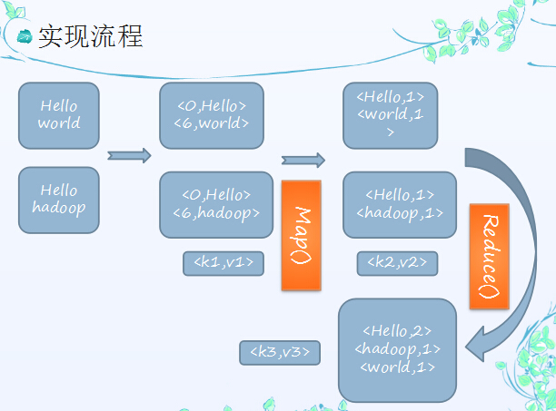

# Hadoop 相关

Hadoop的核心就是HDFS和MapReduce，而两者只是理论基础，不是具体可使用的高级应用，Hadoop旗下有很多经典子项目，比如HBase、Hive等，这些都是基于HDFS和MapReduce发展出来的。要想了解Hadoop，就必须知道HDFS和MapReduce是什么。

## 一、HDFS

HDFS（Hadoop Distributed File System，Hadoop分布式文件系统），它是一个高度容错性的系统，适合部署在廉价的机器上。HDFS能提供高吞吐量的数据访问，适合那些有着超大数据集（large data set）的应用程序。

##### HDFS的设计特点是：

1、大数据文件，非常适合上T级别的大文件或者一堆大数据文件的存储，如果文件只有几个G甚至更小就没啥意思了。
2、文件分块存储，HDFS会将一个完整的大文件平均分块存储到不同计算器上，它的意义在于读取文件时可以同时从多个主机取不同区块的文件，多主机读取比单主机读取效率要高得多得都。
3、流式数据访问，一次写入多次读写，这种模式跟传统文件不同，它不支持动态改变文件内容，而是要求让文件一次写入就不做变化，要变化也只能在文件末添加内容。
4、廉价硬件，HDFS可以应用在普通PC机上，这种机制能够让给一些公司用几十台廉价的计算机就可以撑起一个大数据集群。
5、硬件故障，HDFS认为所有计算机都可能会出问题，为了防止某个主机失效读取不到该主机的块文件，它将同一个文件块副本分配到其它某几个主机上，如果其中一台主机失效，可以迅速找另一块副本取文件。

##### HDFS的关键元素：

* Block：将一个文件进行分块，通常是64M。
* NameNode：保存整个文件系统的目录信息、文件信息及分块信息，这是由唯一一台主机专门保存，当然这台主机如果出错，NameNode就失效了。在Hadoop2.*开始支持activity-standy模式----如果主NameNode失效，启动备用主机运行NameNode。
* DataNode：分布在廉价的计算机上，用于存储Block块文件。

##### HDFS体系结构

文件写入：

   1）  Client向NameNode发起文件写入的请求。

   2）  NameNode根据文件大小和文件块配置情况，返回给Client它管理的DataNode的信息。

   3）  Client将文件划分为多个block，根据DataNode的地址，按顺序将block写入DataNode块中。

文件读取：

   1）  Client向NameNode发起读取文件的请求。

   2）  NameNode返回文件存储的DataNode信息。

   3）  Client读取文件信息。

文件块的放置：一个Block会有三份备份，一份在NameNode指定的DateNode上，一份放在与指定的DataNode不在同一台机器的DataNode上，一根在于指定的DataNode在同一Rack上的DataNode上。备份的目的是为了数据安全，采用这种方式是为了考虑到同一Rack失败的情况，以及不同数据拷贝带来的性能的问题。

HDFS和MR共同组成Hadoop分布式系统体系结构的核心。HDFS在集群上实现了分布式文件系统，MR在集群上实现了分布式计算和任务处理。HDFS在MR任务处理过程中提供了文件操作和存储等支持，MR在HDFS的基础上实现了任务的分发、跟踪、执行等工作，并收集结果，二者相互作用，完成分布式集群的主要任务。


  ## 二、MapReduce

通俗说MapReduce是一套从海量源数据提取分析元素最后返回结果集的编程模型，将文件分布式存储到硬盘是第一步，而从海量数据中提取分析我们需要的内容就是MapReduce做的事了。

MapReduce是一种计算模型，用以进行大数据量的计算。其中Map对数据集上的独立元素进行指定的操作，生成键-值对形式中间结果。Reduce则对中间结果中相同“键”的所有“值”进行规约，以得到最终结果。MapReduce这样的功能划分，非常适合在大量计算机组成的分布式并行环境里进行数据处理。

下面以一个计算海量数据最大值为例：一个银行有上亿储户，银行希望找到存储金额最高的金额是多少，按照传统的计算方式，我们会这样：

  ```
  Long moneys[];
  Long max = 0L;  
  for(int i=0;i<moneys.length;i++){  
    if(moneys[i]>max){  
      max = moneys[i];  
    }  
  }  
  ```

如果计算的数组长度少的话，这样实现是不会有问题的，还是面对海量数据的时候就会有问题。
MapReduce会这样做：首先数字是分布存储在不同块中的，以某几个块为一个Map，计算出Map中最大的值，然后将每个Map中的最大值做Reduce操作，Reduce再取最大值给用户。

##### MapReduce的基本原理就是：

将大的数据分析分成小块逐个分析，最后再将提取出来的数据汇总分析，最终获得我们想要的内容。当然怎么分块分析，怎么做Reduce操作非常复杂，Hadoop已经提供了数据分析的实现，我们只需要编写简单的需求命令即可达成我们想要的数据。

##### Hadoop典型应用有：

搜索、日志处理、推荐系统、数据分析、视频图像分析、数据保存等。

总的来说Hadoop适合应用于大数据存储和大数据分析的应用，适合于服务器几千台到几万台的集群运行，支持PB级的存储容量。

## 三、其他


Hadoop是一个开源框架，它允许在整个集群使用简单编程模型计算机的分布式环境存储并处理大数据。它的目的是从单一的服务器到上千台机器的扩展，每一个台机都可以提供本地计算和存储。

通常，集群里的一台机器被指定为NameNode，另一台不同的机器被指定为JobTracker。这些机器是masters。余下的机器即作为DataNode也作为TaskTracker。这些机器是slaves。

Hadoop守护进程指NameNode/DataNode和JobTracker/TaskTracker。

HDFS由一个NameNode和多个DataNode组成

MapReduce由一个JobTracker和多个TaskTracker组成

* MapReduce为海量的数据提供了计算

* HDFS（Hadoop Distributed File System ）Hadoop分布式文件系统。 HDFS为海量的数据提供了存储。 HDFS是Hadoop应用用到的一个最主要的分布式存储系统。一个HDFS集群主要由一个NameNode和很多个Datanode组成：Namenode管理文件系统的元数据，而Datanode存储了实际的数据。基本上，客户端联系Namenode以获取文件的元数据或修饰属性，而真正的文件I/O操作是直接和Datanode进行交互的。
* NameNode：是Master节点，是大领导。管理数据块映射；处理客户端的读写请求；配置副本策略；管理HDFS的名称空间；namenode内存中存储的是=fsimage+edits。
* SecondaryNameNode：是一个小弟，分担大哥namenode的工作量；是NameNode的冷备份；合并fsimage和fsedits然后再发给namenode。负责定时默认1小时，从namenode上，获取fsimage和edits来进行合并，然后再发送给namenode。减少namenode的工作量。
* DataNode：Slave节点，奴隶，干活的。负责存储client发来的数据块block；执行数据块的读写操作。
* 热备份：b是a的热备份，如果a坏掉。那么b马上运行代替a的工作。
* 冷备份：b是a的冷备份，如果a坏掉。那么b不能马上代替a工作。但是b上存储a的一些信息，减少a坏掉之后的损失。
* fsimage:元数据镜像文件（文件系统的目录树。）
* edits：元数据的操作日志（针对文件系统做的修改操作记录）
* MapReduce：是一种编程模型，用于大规模数据集（大于1TB）的并行运算。映射（Map）、化简（Reduce）的概念和它们的主要思想都是从函数式编程语言中借鉴而来的。它极大地方便了编程人员——即使在不了解分布式并行编程的情况下，也可以将自己的程序运行在分布式系统上。
* historyserver：Hadoop自带了一个历史服务器，可以通过历史服务器查看已经运行完的Mapreduce作业记录，比如用了多少个Map、用了多少个Reduce、作业提交时间、作业启动时间、作业完成时间等信息

[http://blog.csdn.net/zhangliangzi/article/details/52071218](http://blog.csdn.net/zhangliangzi/article/details/52071218)

### 四、mapreduce 实现流程



### 五、基本概念

### Hadoop

- ##### HDFS 海量存储

- ##### MapReduce 海量计算

### Yarn

- ##### ResourceManger 统一管理和调度

- ##### NodeManger 执行任务、领取任务

- ##### ApplicationMaster 向RM申请资源，创建任务

### HDFS

- ##### NameNode 管理

- ##### SecondaryNameNode 协助NameNode（不是副本）

- ##### DataNode 管理存储

### MapReduce

- ##### mapper 拆分

- ##### reducer 合并