# docker 相关

# 一、常用

## 1、在线安装docker

[aliyun 安装docker-ce](https://yq.aliyun.com/articles/110806)

[tsinghua 安装docker-ce](https://mirrors.tuna.tsinghua.edu.cn/help/docker-ce/)

```
curl -sSL https://get.docker.io | bash
```

```
curl -fsSL https://get.docker.com | bash -s docker --mirror Aliyun
```

```
docker --version
docker info
```

## 2、二进制安装

```
wget https://download.docker.com/linux/static/stable/aarch64/docker-20.10.8.tgz

#wget https://download.docker.com/linux/static/stable/x86_64/docker-20.10.8.tgz

tar -zxvf docker-20.10.8.tgz
cp docker/* /usr/bin/
dockerd &
```

> cat /etc/systemd/system/docker.service

```
[Unit]
Description=Docker Application Container Engine
Documentation=https://docs.docker.com
After=network-online.target docker.socket
Wants=network-online.target
Requires=docker.socket

[Service]
Type=notify
# the default is not to use systemd for cgroups because the delegate issues still
# exists and systemd currently does not support the cgroup feature set required
# for containers run by docker
ExecStart=/usr/bin/dockerd -H fd://
ExecReload=/bin/kill -s HUP $MAINPID
LimitNOFILE=1048576
# Having non-zero Limit*s causes performance problems due to accounting overhead
# in the kernel. We recommend using cgroups to do container-local accounting.
LimitNPROC=infinity
LimitCORE=infinity
# Uncomment TasksMax if your systemd version supports it.
# Only systemd 226 and above support this version.
#TasksMax=infinity
TimeoutStartSec=0
# set delegate yes so that systemd does not reset the cgroups of docker containers
Delegate=yes
# kill only the docker process, not all processes in the cgroup
KillMode=process
# restart the docker process if it exits prematurely
Restart=on-failure
StartLimitBurst=3
StartLimitInterval=60s

[Install]
WantedBy=multi-user.target
```

> cat /etc/systemd/system/docker.socket 

```
[Unit]
Description=Docker Socket for the API
PartOf=docker.service

[Socket]
ListenStream=/var/run/docker.sock
SocketMode=0660
SocketUser=root
SocketGroup=docker

[Install]
WantedBy=sockets.target
```

## 3、导入、导出镜像

```
docker save registry:latest > registry.tar.gz
docker save -o registry.tar.gz registry:latest

docker load < registry.tar.gz
docker load -i registry.tar.gz
```

```
docker export <容器ID> | docker import - <镜像名>[:标签]
```

> docker-squash

[https://github.com/jwilder/docker-squash](https://github.com/jwilder/docker-squash)

```
docker save <image id> | sudo docker-squash -t newtag | docker load
```

## 4、启动容器

```
docker run -itd --name mariadb --restart=always -v /opt/mysql:/etc/mysql -p 3306:3306 -e MYSQL_ROOT_PASSWORD=qwe mariadb

docker run --name mariadb -e MYSQL_ROOT_PASSWORD=123456 -p 3306:3306 -v /tmp/my.cnf:/etc/mysql/my.cnf -d mariadb
```

## 5、使用dockerpy

```
>>> import docker
>>> client = docker.DockerClient(base_url='unix://var/run/docker.sock')
```

## 6、docker update

```
docker update --restart=always wiki
docker update --cpu-shares 512 -m 300M abebf7571666 hopeful_morse
docker update --kernel-memory 80M test
```

## 7、查看容器ip地址、id

```
docker inspect -f '\{\{.NetworkSettings.IPAddress\}\}' wiki
docker inspect -f '\{\{.Id\}\}' registry
docker inspect --format '\{\{.Id\}\}' registry
```

## 8、查看全部容器id、占用空间

```
docker ps -qa
docker ps -as
```

## 9、保存镜像

```
docker commit
docker commit -a "user" -m "commit info" [CONTAINER] [imageName]:[imageTag]
docker login --username=[userName] --password=[pwd] [registryURL]
docker tag [imageID] [remoteURL]:[imageTag]
docker push [remoteURL]:[imageTag]
docker pull [remoteURL]:[imageTag]
docker diff
```

## 10、--restart

```
no – 默认值，如果容器挂掉不自动重启

on-failure – 当容器以非 0 码退出时重启容器,同时可接受一个可选的最大重启次数参数 (e.g. on-failure:10)

always – 不管退出码是多少都要重启
```

## 11、资源限制

```
# 限制内存最大使用
-m 1024m --memory-swap=1024m
# 限制容器使用CPU
--cpuset-cpus="0,1"
```

## 12、一个容器连接到另一个容器

```
docker run -i -t --name sonar -d -link mmysql:db  tpires/sonar-server sonar
```

## 13、构建自己的镜像

```
docker build -t <镜像名> <Dockerfile路径>
docker build -t xx/gitlab .
```

## 14、查看容器端口

```
docker port registry
```

## 15、查看容器进程

```
docker top registry
```

## 16、监控容器资源使用情况

```
docker stats
docker stats --no-stream
```

## 17、批量删除名字包含"none"的镜像

```
docker rmi $(docker images | grep "none" | awk '{print $3}')
```

## 18、查看可用命令

```
docker help
```

## 19、login

```
docker login --username=yourhubusername --email=youremail@company.com
```

## 20、删除已安装docker

```
yum list installed | grep docker
yum remove -y docker.x86_64
yum remove -y docker-client.x86_64
yum remove -y docker-common.x86_64
```

## 21、配置国内docker源

```
vim /etc/docker/daemon.json
{"registry-mirrors": ["https://docker.mirrors.ustc.edu.cn"]  }
systemctl restart docker
```

## 22、使用 --volumes-from 备份

```
docker run --rm --volumes-from gitlab -v /backup1:/backup2 ubuntu tar cvf /backup2/gitlab-etc.tar /etc/gitlab
```

## 23、清理

```
$ cat /usr/bin/prune_docker.sh
#!/bin/bash
docker container prune -f # 删除所有退出状态的容器
docker volume prune -f # 删除未被使用的数据卷
docker image prune -f # 删除 dangling 或所有未被使用的镜像

$ crontab -l
0 0 * * * /usr/bin/prune_docker.sh >> /var/log/prune_docker.log 2>&1
```

## 24、docker 代理

```
cat /etc/systemd/system/docker.service.d/http-proxy.conf

[Service]
Environment="HTTP_PROXY=http://proxy.server:port"
Environment="HTTPS_PROXY=http://proxy.server:port"
Environment="NO_PROXY=localhost,127.0.0.1"

systemctl daemon-reload
systemctl restart docker
```

## 25、使用本地仓库

```
vim /etc/docker/daemon.json

{
    "insecure-registries": ["192.168.0.11:30002"]
}

systemctl daemon-reload
systemctl restart docker
```

## 26、azk8s.cn 支持镜像转换列表

| global                                                       | proxy in China                                               | format                  | example                                                      |
| ------------------------------------------------------------ | ------------------------------------------------------------ | ----------------------- | ------------------------------------------------------------ |
| [dockerhub](https://www.cnblogs.com/xuxinkun/p/hub.docker.com) (docker.io) | [dockerhub.azk8s.cn](http://mirror.azk8s.cn/help/docker-registry-proxy-cache.html) | `dockerhub.azk8s.cn//:` | `dockerhub.azk8s.cn/microsoft/azure-cli:2.0.61` `dockerhub.azk8s.cn/library/nginx:1.15` |
| gcr.io                                                       | [gcr.azk8s.cn](http://mirror.azk8s.cn/help/gcr-proxy-cache.html) | `gcr.azk8s.cn//:`       | `gcr.azk8s.cn/google_containers/hyperkube-amd64:v1.13.5`     |
| quay.io                                                      | [quay.azk8s.cn](http://mirror.azk8s.cn/help/quay-proxy-cache.html) | `quay.azk8s.cn//:`      | `quay.azk8s.cn/deis/go-dev:v1.10.0`                          |

## 27、docker in docker

```
docker run -itd --privileged=true -v /var/run/docker.sock:/var/run/docker.sock -v $(which docker):/bin/docker --name centos centos
```

## 28、不裁剪输出

```
docker ps -a --no-trunc
```

## 29、创建docker网络并使用

> 备注：subnet指定一个网段， -o选项可以解决使用ifconfig命令看不到自己创建的网桥名字的问题

```
docker network create docker01 --subnet=10.10.10.0/24 -o com.docker.network.bridge.name=docker01
```

```
docker run -itd --net docker01 --ip 10.10.10.51  镜像名
```

## 30、多阶段构建

```
FROM gcc AS mybuildstage
COPY hello.c .
RUN gcc -o hello hello.c
FROM ubuntu
COPY --from=mybuildstage hello .
CMD ["./hello"]
```

## 31、修改 cgroupdriver

```
vim /etc/systemd/system/docker.service.d/docker-options.conf
...
--exec-opt native.cgroupdriver=systemd
...
--exec-opt native.cgroupdriver=cgroupfs
...
```

## 32、build 不交互

```
export DEBIAN_FRONTEND=noninteractive
```

## 33、以非root用户运行docker

```
sudo groupadd docker 
sudo usermod –aG docker $USER 
```

## 32、qt in docker

```
xhost + > /dev/null 2>&1
```

```
#!/bin/bash
  
xhost + > /dev/null 2>&1

create_data_volume(){
  for i in $@; do
    name=$(echo $i|cut -d: -f1)
    version=$(echo $i|cut -d: -f2)
    if [ -z "$(docker ps -a -f NAME=$name |grep -v CONTAINER)" ]; then
      echo "Creating $name..."
      docker create --name $name $name:$version
    else
      echo "$name is existed, skipped."
    fi
  done
}

create_data_volume poky:1.0.0

if [ ! -z "$(docker ps -a -f NAME=qt5.6.3 |grep -v CONTAINER)" ]; then
  echo "Starting qt5.6.3..."
  docker restart -t 1 qt5.6.3
else
  echo "Runing qt5.6.3..."
  docker run -itd --net=host \
    -v $HOME/.Xauthority:$HOME/.Xauthority \
    -v /tmp/.X11-unix:/tmp/.X11-unix \
    -e DISPLAY=$DISPLAY \
    --volumes-from poky:ro \
    -v /opt/qtworkspace:/opt/workspace \
    --name qt5.6.3 qt5.6.3:1.0.0
fi
```

## 33、最小化安装应用

```
apt install --no-install-recommends --no-install-suggests
rm -rf /var/lib/apt/lists/*
```

```
apk add --no-cache
rm -rf /var/cache/apk/*
```

```
pip install --no-cache-dir
docker build --no-cache
```

## 34、使用cache构建镜像

```
docker build –cache-from mongo:3.2 -t mongo:3.2.1 .
```

## 35、docker远程访问

```
vim /lib/systemd/system/docker.service
ExecStart=/usr/bin/dockerd -H tcp://0.0.0.0:2376 -H fd:// --containerd=/run/containerd/containerd.sock
```

```
systemctl daemon-reload
service docker restart
```

```
curl http://localhost:2375/version
```

```
tcp://192.168.0.127:2376
```

## 36、k8s http api server

```
kubectl proxy --address='0.0.0.0' --accept-hosts='^*$' --port=8080
```

## 37、docker 目录迁移

##### 方法一

```
systemctl stop docker
mv /var/lib/docker /data/
#cp -arv /var/lib/docker /data/
ln -s /data/docker /var/lib/docker
systemctl start docker
```

##### 方法二

```
vim /lib/systemd/system/docker.service
ExecStart=/usr/bin/dockerd --graph=/data/docker/
```

```
vim /etc/docker/daemon.json
{
    "live-restore": true,
    "graph": [ "/data/docker/" ]
}
```

## 38、设备空间不足

##### 1、磁盘用完

```
docker info

du -d1 -h /var/lib/docker/containers | sort -h
cat /dev/null > /var/lib/docker/containers/container_id/container_log_name

```

##### 2、容器默认大小限制

> CentOS7 使用docker容器默认的创建大小为10GB

```
vim  /etc/docker/daemon.json
{
    "live-restore": true,
    "storage-opt": [ "dm.basesize=20G" ]
}
```

```
systemctl stop docker
rm -rf /var/lib/docker

vim /usr/lib/systemd/system/docker.service
ExecStart=/usr/bin/dockerd
and change it to:
ExecStart=/usr/bin/dockerd --storage-opt dm.basesize=20G

systemctl daemon-reload
systemctl start docker
```

##### 3、inode节点数满了

> 文件存储在磁盘上，磁盘的最小存储单位叫做扇区（Sector）。每个扇区存储 512字节（0.5KB），操作系统读取硬盘的时候，不会一个扇区的读取，效率太低，而是一次性读取多个扇区，即一次性读取一个块（block）。这种由多个扇区组成的块，是文件系统存取的最小单位。块的大小，最常见的是4KB，即连续八个sector组成一个块。文件数据存储在块中，还必须找个一个地方存储文件的元数据，比如文件的创建者、文件的创建日期 、文件的大小等等。这种存储元数据的区域就叫做索引节点（inode）。每个文件都有对应的inode，里面包含了文件名以外的所有文件信息。

> inode也会消耗磁盘空间，所以磁盘格式化的时候，操作系统自动将磁盘分为两个区域。一个是数据区，存放文件数据；另一个是inode区（inode table）存放inode所包含的信息。每个inode节点的大小，一般是128字节或256字节。inode节点的总数在格式化时就给定，一般是每1KB或每2KB就设置一个inode节点。

```
# 报错信息
No space left on device

# 查看系统的inode节点使用情况
df -i

# 尝试重新挂载
mount -o remount -o noatime,nodiratime,inode64,nobarrier /dev/vda1
```

## 39、docker 容器文件损坏

> 容器文件损坏，经常导致容器无法操作。正常的docker命令已经无法操控这台容器，无法关闭、重启、删除。

> \# 操作容器遇到类似的错误
> b'devicemapper: Error running deviceCreate (CreateSnapDeviceRaw) dm_task_run failed'

```
systemctl stop docker

删除容器文件
rm -rf /var/lib/docker/containers

重新整理容器元数据
thin_check /var/lib/docker/devicemapper/devicemapper/metadata
thin_check --clear-needs-check-flag /var/lib/docker/devicemapper/devicemapper/metadata

systemctl start docker
```

## 40、docker 容器优雅的重启

> 不停止服务器上面的容器，重启dockerd服务。

> 从docker-ce1.12开始，可以配置live-restore参数，以便在守护进程变得不可用时容器保持运行。

```
vim /etc/docker/daemon.yaml
{
  "live-restore": true
}

# 在守护进程停机期间保持容器存活
dockerd --live-restore

# 只能使用reload重载
# 相当于发送SIGHUP信号量给dockerd守护进程
systemctl reload docker

# 但是对应网络的设置需要restart才能生效
systemctl restart docker
```

## 41、docker 容器无法删除

> Error response from daemon: Conflict, cannot remove the default name of the container

```
# 删除容器文件
rm -rf /var/lib/docker/containers/f8e8c3...65720

# 重启服务
systemctl restart docker.service
```

## 42、docker 容器中文异常

```
# 临时解决
docker exec -it some-mysql env LANG=C.UTF-8 /bin/bash

# 永久解决
docker run --name some-mysql \
    -e MYSQL_ROOT_PASSWORD=my-secret-pw \
    -d mysql:tag --character-set-server=utf8mb4 \
    --collation-server=utf8mb4_unicode_ci
```

## 43、docker容器总线错误

> Bus error (core dumped)

> 原因是在 `docker` 运行的时候，`shm` 分区设置太小导致 `share memory` 不够。不设置 `--shm-size` 参数时，`docker` 给容器默认分配的 `shm` 大小为 `64M`，导致程序启动时不足。具体原因还是因为安装 `pytorch` 包导致了，多进程跑任务的时候，`docker` 容器分配的共享内存太小，导致 `torch` 要在 `tmpfs` 上面放模型数据用于子线程的 共享不足，就出现报错了。

```
# 问题原因
df -TH
Filesystem     Type     Size  Used Avail Use% Mounted on
overlay        overlay  2.0T  221G  1.4T   3% /
tmpfs          tmpfs     68M     0   68M   0% /dev
shm            tmpfs     68M   41k   68M   1% /dev/shm

# 启动docker的时候加上--shm-size参数(单位为b,k,m或g)
docker run -it --rm --shm-size=200m pytorch/pytorch:latest

# 在docker-compose添加对应配置
shm_size: '2gb'
```

## 44、docker配置默认网段

```
cat /etc/docker/daemon.json
{
    "registry-mirrors": ["https://XXXX"],
    "default-address-pools":[{"base":"172.17.0.0/12", "size":24}],
    "experimental": true,
    "default-runtime": "nvidia",
    "live-restore": true,
    "runtimes": {
        "nvidia": {
            "path": "/usr/bin/nvidia-container-runtime",
            "runtimeArgs": []
        }
    }
}

docker network inspect app | grep Subnet
```

## 45、docker定时任务

```
# Crontab定时任务
0 */6 * * * \
    docker exec -t <container_name> sh -c \
        'exec mysqldump --all-databases -uroot -ppassword ......'
```

## 46、docker删除镜像报错

```
# 查询依赖 - image_id表示镜像名称
docker image inspect --format='{{.RepoTags}} {{.Id}} {{.Parent}}' $(docker image ls -q --filter since=<image_id>)

# 根据TAG删除镜像
docker rmi -f c565xxxxc87f

# 删除悬空镜像
docker rmi $(docker images --filter "dangling=true" -q --no-trunc)
```

## 47、scratch镜像

[https://docs.docker.com/develop/develop-images/baseimages/#create-a-simple-parent-image-using-scratch](https://docs.docker.com/develop/develop-images/baseimages/#create-a-simple-parent-image-using-scratch)

```
FROM scratch
ADD hello /
CMD ["/hello"]
```

```
apt-get install build-essential
gcc -o hello -static hello.c

musl-gcc -o hello -static hello.c
```

# 二、linux实现docker资源隔离

Linux 提供的主要的 NameSpace

- Mount NameSpace- 用于隔离文件系统的挂载点
- UTS NameSpace- 用于隔离 HostName 和 DomianName
- IPC NameSpace- 用于隔离进程间通信
- PID NameSpace- 用于隔离进程 ID
- Network NameSpace- 用于隔离网络
- User NameSpace- 用于隔离用户和用户组 UID/GID

# 三、理解Docker容器和镜像

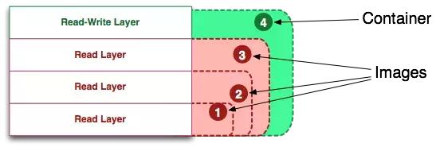

##### Image Definition

> 镜像（Image）就是一堆只读层（read-only layer）的统一视角，也许这个定义有些难以理解，下面的这张图能够帮助理解镜像的定义。

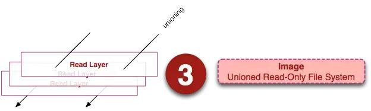

> 从左边看到了多个只读层，它们重叠在一起。除了最下面一层，其它层都会有一个指针指向下一层。这些层是Docker内部的实现细节，并且能够在主机（运行Docker的机器）的文件系统上访问到。统一文件系统（union file system）技术能够将不同的层整合成一个文件系统，为这些层提供了一个统一的视角，这样就隐藏了多层的存在，在用户的角度看来，只存在一个文件系统。就可以在图片的右边看到这个视角的形式。可以在主机文件系统上找到有关这些层的文件。需要注意的是，在一个运行中的容器内部，这些层是不可见的。在我的主机上，我发现它们存在于/var/lib/docker/aufs目录下。

```
sudo tree -L 1 /var/lib/docker//var/lib/docker/├── aufs├── containers├── graph├── init├── linkgraph.db├── repositories-aufs├── tmp├── trust└── volumes7 directories, 2 files
```

##### Container Definition

> 容器（container）的定义和镜像（image）几乎一模一样，也是一堆层的统一视角，唯一区别在于容器的最上面那一层是可读可写的。

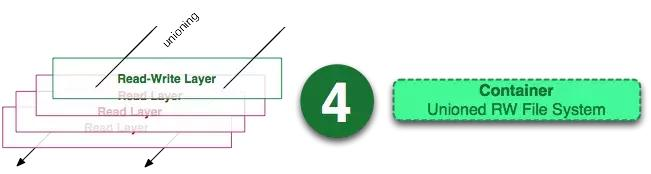

> 可能会发现，容器的定义并没有提及容器是否在运行，没错，这是故意的。要点：容器 = 镜像 + 读写层。并且容器的定义并没有提及是否要运行容器。

##### Running Container Definition

> 一个运行态容器（running container）被定义为一个可读写的统一文件系统加上隔离的进程空间和包含其中的进程。下面这张图片展示了一个运行中的容器。

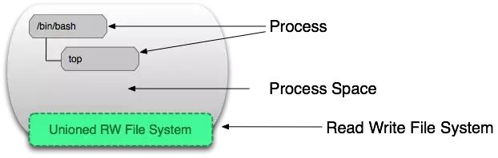

> 正是文件系统隔离技术使得Docker成为了一个前途无量的技术。一个容器中的进程可能会对文件进行修改、删除、创建，这些改变都将作用于可读写层（read-write layer）。下面这张图展示了这个行为。

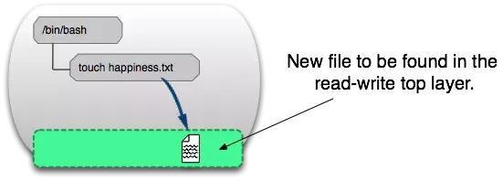

> 可以通过运行以下命令来验证上面所说的：

```
docker run ubuntu touch happiness.txt
```

> 即便是这个ubuntu容器不再运行，依旧能够在主机的文件系统上找到这个新文件。

```
find / -name happiness.txt/var/lib/docker/aufs/diff/860a7b...889/happiness.txt
```

##### Image Layer Definition

> 为了将零星的数据整合起来，提出了镜像层（image layer）这个概念。下面的这张图描述了一个镜像层，通过图片能够发现一个层并不仅仅包含文件系统的改变，它还能包含了其他重要信息。

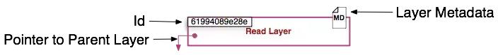

> 元数据（metadata）就是关于这个层的额外信息，它不仅能够让Docker获取运行和构建时的信息，还包括父层的层次信息。需要注意，只读层和读写层都包含元数据。

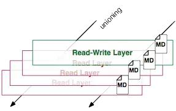

> 除此之外，每一层都包括了一个指向父层的指针。如果一个层没有这个指针，说明它处于最底层。


##### Metadata Location

> 我发现在我自己的主机上，镜像层（image layer）的元数据被保存在名为”json”的文件中，比如说：

```
/var/lib/docker/graph/e809f156dc985.../json
```

> e809f156dc985...就是这层的id

> 一个容器的元数据好像是被分成了很多文件，但或多或少能够在/var/lib/docker/containers/<id>目录下找到，<id>就是一个可读层的id。这个目录下的文件大多是运行时的数据，比如说网络，日志等等。

#### 全局理解（Tying It All Together)

> 现在，让结合上面提到的实现细节来理解Docker的命令。

```
docker create <image-id>
```

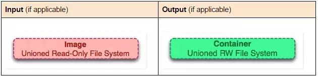

> docker create 命令为指定的镜像（image）添加了一个可读写层，构成了一个新的容器。注意，这个容器并没有运行。


```
docker start <container-id>
```

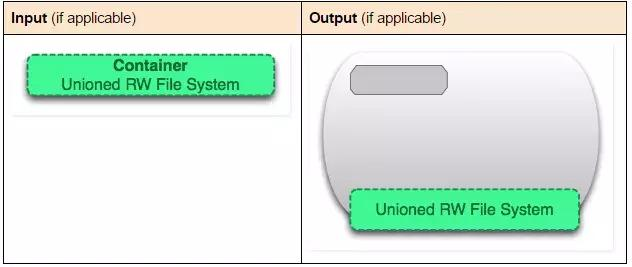

> Docker start命令为容器文件系统创建了一个进程隔离空间。注意，每一个容器只能够有一个进程隔离空间。

```
docker run <image-id>
```

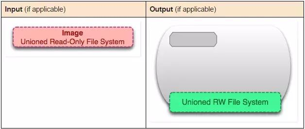

> 看到这个命令，通常会有一个疑问：docker start 和 docker run命令有什么区别。

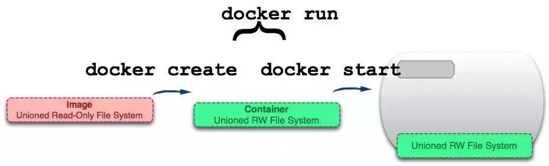

> 从图片可以看出，docker run 命令先是利用镜像创建了一个容器，然后运行这个容器。这个命令非常的方便，并且隐藏了两个命令的细节，但从另一方面来看，这容易让用户产生误解。

```
docker ps
```

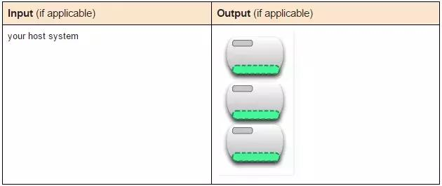

> docker ps 命令会列出所有运行中的容器。这隐藏了非运行态容器的存在，如果想要找出这些容器，我们需要使用下面这个命令。

```
docker ps –a
```

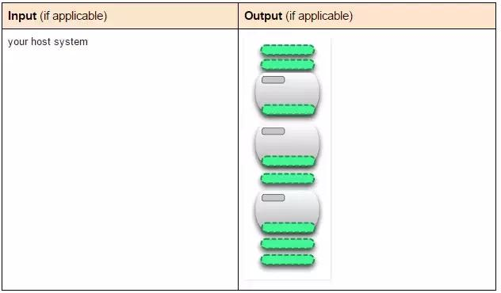

> docker ps –a命令会列出所有的容器，不管是运行的，还是停止的。

```
docker images
```

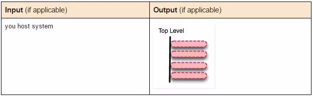

> docker images命令会列出了所有顶层（top-level）镜像。实际上，在这里我们没有办法区分一个镜像和一个只读层，所以我们提出了top-level镜像。只有创建容器时使用的镜像或者是直接pull下来的镜像能被称为顶层（top-level）镜像，并且每一个顶层镜像下面都隐藏了多个镜像层。

```
docker images –a
```

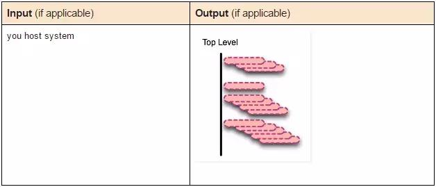

> docker images –a命令列出了所有的镜像，也可以说是列出了所有的可读层。如果想要查看某一个image-id下的所有层，可以使用docker history来查看。

```
docker stop <container-id>
```

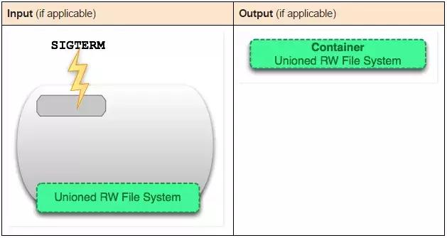

> docker stop命令会向运行中的容器发送一个SIGTERM的信号，然后停止所有的进程。

```
docker kill <container-id>
```


> docker kill 命令向所有运行在容器中的进程发送了一个不友好的SIGKILL信号。

```
docker pause <container-id>
```

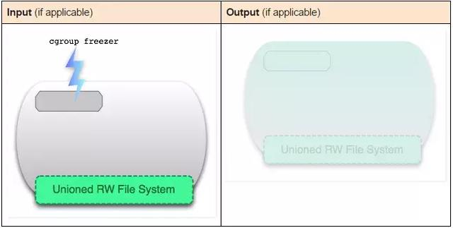

> docker stop和docker kill命令会发送UNIX的信号给运行中的进程，docker pause命令则不一样，它利用了cgroups的特性将运行中的进程空间暂停。具体的内部原理可以在这里找到：https://www.kernel.org/doc/Doc ... m.txt，但是这种方式的不足之处在于发送一个SIGTSTP信号对于进程来说不够简单易懂，以至于不能够让所有进程暂停。

```
docker rm <container-id>
```

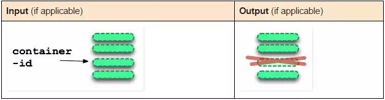

> docker rm命令会移除构成容器的可读写层。注意，这个命令只能对非运行态容器执行。

```
docker rmi <image-id>
```

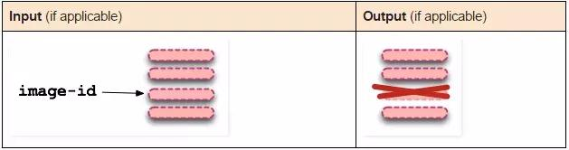

> docker rmi 命令会移除构成镜像的一个只读层。只能够使用docker rmi来移除最顶层（top level layer）（也可以说是镜像），也可以使用-f参数来强制删除中间的只读层。

```
docker commit <container-id>
```

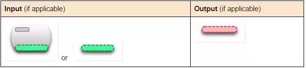


> docker commit命令将容器的可读写层转换为一个只读层，这样就把一个容器转换成了不可变的镜像。

```
docker build
```

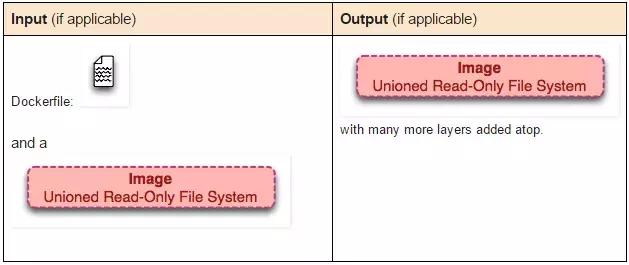

> docker build命令非常有趣，它会反复的执行多个命令。

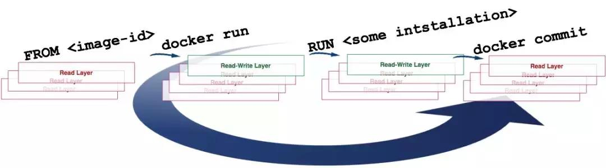

> 从上图可以看到，build命令根据Dockerfile文件中的FROM指令获取到镜像，然后重复地1）run（create和start）、2）修改、3）commit。在循环中的每一步都会生成一个新的层，因此许多新的层会被创建。

```
docker exec <running-container-id>
```

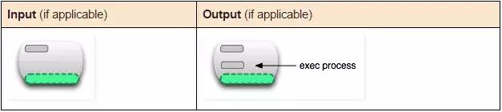

> docker exec 命令会在运行中的容器执行一个新进程。

```
docker inspect <container-id> or <image-id>
```

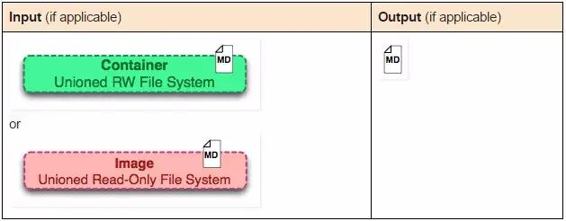

> docker inspect命令会提取出容器或者镜像最顶层的元数据。

```
docker save <image-id>
```

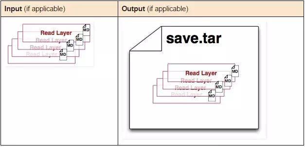

> docker save命令会创建一个镜像的压缩文件，这个文件能够在另外一个主机的Docker上使用。和export命令不同，这个命令为每一个层都保存了它们的元数据。这个命令只能对镜像生效。

```
docker export <container-id>
```

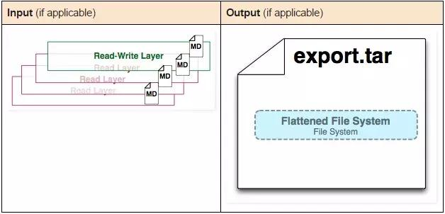

> docker export命令创建一个tar文件，并且移除了元数据和不必要的层，将多个层整合成了一个层，只保存了当前统一视角看到的内容（译者注：expoxt后的容器再import到Docker中，通过docker images –tree命令只能看到一个镜像；而save后的镜像则不同，它能够看到这个镜像的历史镜像）。

```
docker history <image-id>
```

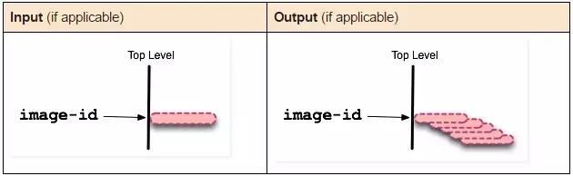

> docker history命令递归地输出指定镜像的历史镜像。

# 四、编写dockerfile的最佳实践

##### 1、创建短暂的容器

> 你定义的图像Dockerfile应该生成尽可能短暂的容器。通过“短暂”，我们的意思是容器可以被停止和销毁，然后重建并用绝对最小的设置和配置替换。

##### 2、了解构建上下文

> 发出docker build命令时，当前工作目录称为*构建上下文*。默认情况下，假定Dockerfile位于此处，但您可以使用文件flag（-f）指定其他位置。无论Dockerfile实际存在的位置如何，当前目录中的所有文件和目录的递归内容都将作为构建上下文发送到Docker守护程序。

##### 3、通过stdin管道Dockerfile

> Docker能够通过stdin与本地或远程构建上下文管道Dockerfile来构建映像。 通过stdin管道Dockerfile对于执行一次性构建非常有用，无需将Dockerfile写入磁盘，或者在生成Dockerfile的情况下，并且之后不应该持久化。

##### 4、排除.dockerignore

> 要排除与构建无关的文件（不重构源存储库），请使用.dockerignore文件。此文件支持与.gitignore文件类似的排除模式。

##### 5、使用多阶段构建

> 多阶段构建允许您大幅减小最终image的大小，而无需减少中间层和文件的数量。

> 由于image是在构建过程的最后阶段构建的，因此可以通过利用构建缓存来最小化image层。

##### 6、避免安装不必要的包

> 为了降低复杂性，依赖性，文件大小和构建时间，请避免安装额外的或不必要的软件包，只是因为它们可能“很好”。

##### 7、解耦应用程序

> 每个容器应该只关注一个问题。将应用程序分离到多个容器中可以更容易地水平扩展和重用容器。

##### 8、最小化层数

> 只有说明RUN，COPY，ADD创建图层。其他指令创建临时中间图像，并不增加构建的大小。

> 在可能的情况下，使用多阶段构建，并仅将所需的工件复制到最终图像中。这允许您在中间构建阶段中包含工具和调试信息，而不会增加最终图像的大小。

##### 9、对多行参数进行排序

> 只要有可能，通过按字母顺序排序多行参数来缓解以后的更改。这有助于避免重复包并使列表更容易更新。这也使PR更容易阅读和审查。

##### 10、利用构建缓存

> 构建映像时，Docker会逐步Dockerfile执行您的指令， 按指定的顺序执行每个指令。在检查每条指令时，Docker会在其缓存中查找可以重用的现有image，而不是创建新的（重复）image。