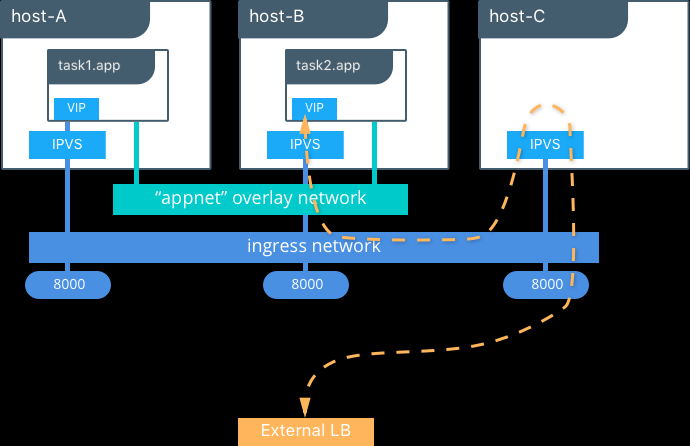

# docker 网络相关

## 一、docker 五种网络模式

在docker run --net选项指定容器网络模式，docker有以下4种网络模式：

> docker使用linux的namespace技术来进行资源隔离，如pid namespace隔离进程，mount namespace隔离文件系统，network namespace提供一份独立的网络环境，包括网卡、路由、iptable规则等都与其他的network namespace隔离。一个docker容器一般会分配一个独立的network namespace。

##### 1、host模式，--net=host

> 但如果启动容器的时候使用host模式，那么这个容器将不会获得一个独立的network namespace，而是贺宿主机共用一个network namespace。容器将不会虚拟出自己的网卡、配置自己的ip等，而是使用宿主机的ip和端口。容器进程可以跟主机其它 root 进程一样可以打开低范围的端口，可以访问本地网络服务比如 D-bus，还可以让容器做一些影响整个主机系统的事情，比如重启主机。因此使用这个选项的时候要非常小心。如果进一步的使用 `--privileged=true`，容器会被允许直接配置主机的网络堆栈。

> 例如，我们在10.10.101.105/24的机器上用host模式启动一个含有web应用的docker容器，监听tcp 80端口。在容器中执行任何类似ifconfig命令查看网络环境时，看到的都是宿主机上的信息。而外界访问容器中的应用，则直接使用10.10.101.105:80即可，不用任何nat转换，就如直接跑在宿主机中一样。但是，容器的其他方面，如文件系统、进程列表等还是和宿主机隔离的。

##### 2、container模式，--net=container:NAME_or_ID

> 这个模式指定新创建的容器和已经存在的一个容器共享一个network namespace，而不是和宿主机共享。新创建的容器不会创建自己的网卡、配置自己的ip，而是和一个指定的容器共享ip、端口范围等。同样，两个容器除了网络方面，其他的如文件系统、进程列表等还是隔离的。两个容器的进程可以通过lo回环网卡设备通信。

##### 3、none模式，--net=none

> 这个模式和前两个不同。在这种模式下，docker容器拥有自己的network namespace，但是，并不为docker容器进行任何网络配置。也就是说，这个docker容器，只用lo回环网络，没有网卡、ip、路由等信息。需要我们自己为docker容器添加网卡、配置ip等。这个封闭的网络很好的保证了容器的安全性。

##### 4、bridge模式，--net=bridge

> bridge模式是docker默认的网络设置，此模式会为每一个容器分配network namespace、设置ip等，并将一个主机上的docker容器连接到一个虚拟网桥上。
>
> 1.在主机上创建一对虚拟网卡veth pair设备。veth设备总是成对出现的，它们组成了一个数据的通道，数据从一个设备进入，就会从另一个设备出来。因此，veth设备常用来连接两个网络设备。
>
> 2.docker将veth pair设备的一端放在新创建的容器中，并命名为eth0。另一端放在主机中，以veth65f9这样类似的名字命名，并将这个网络设备加入到docker0网桥中，可以通过brctl show命令查看。
>
> 3.从docker0子网中分配一个IP给容器使用，并设置docker0的IP地址为容器的默认网关。

##### 5、user-defined模式

> 用户自定义模式，主要可选的有三种网络驱动：bridge、overlay、macvlan。bridge驱动用于创建类似于前面提到的bridge网络。overlay和macvlan驱动主要用于跨主机的网络。

* overlay模式

>overlay网络将多个docker守护进程连接在一起，并使集群服务能够相互通信。还可以使用overlay网络来实现swarm集群和独立容器之间的通信，或者不同docker守护进程上的两个独立容器之间的通信。该策略实现了在这些容器之间进行操作系统级别路由的需求。

* macvlan模式

> macvlan网络允许为容器分配mac地址，使其显示为网络上的物理设备。docker守护进程通过其mac地址将流量路由到容器。对于希望直连到物理网络的传统应用程序而言，使用macvlan模式一般是最佳的选择，而不应该通过docker宿主机的网络进行路由。

## 二、跨主机通讯模式

docker在垮主机通信方面一直比较弱。目前主要有容器网络模型（CNM）和容器网络接口（CNI）。k8s和docker之间通信采纳的是CNI。

##### 1、CNM模式（container network model）

> CNM是一个被 Docker 提出的规范。现在已经被Cisco Contiv, Kuryr, Open Virtual Networking (OVN), Project Calico, VMware 和 Weave 这些公司和项目所采纳。
>
> libnetwork是CNM的原生实现。它为docker daemon和网络驱动程序之间提供了接口。网络控制器负责将驱动和一个网络进行对接。每个驱动程序负责管理它所拥有的网络以及为该网络提供的各种服务。网络驱动可以按提供方式被划分为原生驱动（libnetwork内置的或docker支持的）或者远程驱动（第三方插件）。原生驱动包括none、bridge、overlay以及macvlan。驱动也可以按照使用范围被划分为本地（单主机）和全局（多主机）。

##### 2、CNI模式（container network interface）

> CNI是google和coreos主导制定的容器网络标准，可以理解成一个协议。这个标准是在rkt网络提议基础上发展去来的，综合考虑了灵活性、扩展性、ip分配、多网卡等因素。

> CNI本身实现了一些基本插件，比如bridge、ipvlan、macvlan、loopback、vlan等网络接口管理插件，还有dhcp、host-local等ip管理插件，并且主流的container网络解决方案都有对应CNI的支持能力，比如Flannel、Calico、Weave、Contiv、SR-IOV、Amazon ECS CNI Plugins等。

## 三、docker swarm 网络

* q: quantum

* v: veth

* b: bridge

* o: openvswitch

* qvb: quamtum veth bridge

* qvo: quamtum veth openvswitch

* br-int(集成网桥)

  > br-int是由OpenvSwitch虚拟化出来的网桥，但事实上它已经充当了一个虚拟交换机的功能了。br-int的主要职责就是把它所在的计算节点上的VM都连接到它这个虚拟交换机上面，然后利用br-tun的穿透功能，实现了不同计算节点上的VM连接在同一个逻辑上的虚拟交换机上面的功能。

* br-tun(通道网桥)

  > br-tun同样也是是OpenvSwitch虚拟化出来的网桥，但是它不是用来充当虚拟交换机的，它的存在只是用来充当一个通道层，通过它上面的设备G与其他物理机上的br-tun通信，构成一个统一的通信层。这样的话，网络节点和计算节点、计算节点和计算节点这样就会点对点的形成一个以GRE为基础的通信网络，互相之间通过这个网络进行大量的数据交换。这样，网络节点和计算节点之间的通信就此打通了

* br-ex(外部网桥)

  > 当数据从router中路由出来后，就会通过L、K传送到br-ex这个虚拟网桥上，而br-ex实际上是混杂模式加载在物理网卡上，实时接收着网络上的数据包。至此，计算节点上的VM就可以与外部的网络进行自由的通信了。当然，前提是要给这个VM已经分配了float-ip。

* overlay networks

  > 管理swarm中docker守护进程间的通信，可以将服务附加到一个或多个已存在的overlay网络上，使得服务与服务之间能够通信。

* ingress network

  > 是一个特殊的overlay网络，用于服务节点间的负载均衡。但任何swarm节点在发布的端口上接受到请求时，它将该请求交给一个名为IPVS的模块。IPVS跟踪参与该服务的所有IP地址，选择其中一个，并通过ingress网络将请求路由到它。
  >
  > 初始化或加入swarm集群时会自动创建ingress网络，大多数情况下，用户不需要自定义配置。

* ingress

  > ingress就是为了进入集群的请求提供路由规则的集合，ingress可以给k8s service提供集群外部访问的URL、负载均衡、SSL终止、HTTP路由等。为了配置这些ingress规则，集群管理员需要部署一个ingress controller，它监听ingress和service的变化，并根据规则配置负载均衡并提供访问入口。每个ingress都需要配置rules，目前k8s仅支持http规则。
  
* docker_gwbridge

  > 是一种桥接网络，将overlay网络（包括ingress网络）连接到一个单独的docker守护进程的物理网络。默认情况下，服务正在运行的每个容器都连接到本地docker守护进程主机的docker_gwbridge网络。
  >
  > docker_gwbridge网络在初始化或加入swarm时自动创建。大多数情况下，用户不需要自定义配置，但是docker允许自定义。



（一）查看容器网络有三张网卡

```
# docker exec 4b805190a52b ip a
1: lo: <LOOPBACK,UP,LOWER_UP> mtu 65536 qdisc noqueue state UNKNOWN qlen 1000
    link/loopback 00:00:00:00:00:00 brd 00:00:00:00:00:00
    inet 127.0.0.1/8 scope host lo
       valid_lft forever preferred_lft forever
80: eth0@if81: <BROADCAST,MULTICAST,UP,LOWER_UP,M-DOWN> mtu 1450 qdisc noqueue state UP 
    link/ether 02:42:0a:ff:00:21 brd ff:ff:ff:ff:ff:ff
    inet 10.255.0.33/16 brd 10.255.255.255 scope global eth0
       valid_lft forever preferred_lft forever
84: eth2@if85: <BROADCAST,MULTICAST,UP,LOWER_UP,M-DOWN> mtu 1500 qdisc noqueue state UP 
    link/ether 02:42:ac:12:00:09 brd ff:ff:ff:ff:ff:ff
    inet 172.18.0.9/16 brd 172.18.255.255 scope global eth2
       valid_lft forever preferred_lft forever
86: eth1@if87: <BROADCAST,MULTICAST,UP,LOWER_UP,M-DOWN> mtu 1450 qdisc noqueue state UP 
    link/ether 02:42:0a:00:04:13 brd ff:ff:ff:ff:ff:ff
    inet 10.0.4.19/24 brd 10.0.4.255 scope global eth1
       valid_lft forever preferred_lft forever

```

### （二）网卡eth2@if85，172.18.0.9/16

##### 1、查看宿主机网络，启动有一个网桥docker_gwbridge

```
# docker network ls
NETWORK ID          NAME                                              DRIVER              SCOPE
b7d628709937        docker_gwbridge                                   bridge              local
```
##### 2、查看docker_gwbridge详情，能看到容器4b805190a5的网络挂载在该网桥上

```
# docker inspect docker_gwbridge
[
    {
        "Name": "docker_gwbridge",
        "Id": "b7d6287099378a319ac5649af8bf40a1aa4ecdaa35a1d88d202922a94ebc9a02",
        "Created": "2019-05-23T09:44:30.296117498Z",
        "Scope": "local",
        "Driver": "bridge",
        "EnableIPv6": false,
        "IPAM": {
            "Driver": "default",
            "Options": null,
            "Config": [
                {
                    "Subnet": "172.18.0.0/16",
                    "Gateway": "172.18.0.1"
                }
            ]
        },
        "Internal": false,
        "Attachable": false,
        "Ingress": false,
        "ConfigFrom": {
            "Network": ""
        },
        "ConfigOnly": false,
        "Containers": {
            "4b805190a52b793ee947654e2dc290535c17d134d52391a4ac53fc22ada7056b": {
                "Name": "gateway_29319ccc19b3",
                "EndpointID": "ede79bc08c8d4acbc18f893e20975bef25526b4a6a279d0ab026a545f4a4f040",
                "MacAddress": "02:42:ac:12:00:09",
                "IPv4Address": "172.18.0.9/16",
                "IPv6Address": ""
            },
            "ingress-sbox": {
                "Name": "gateway_ingress-sbox",
                "EndpointID": "7d8688816cc8f54a7730b4d6a9bf70425fc5202a5cd39a2f23b51741e6443bcc",
                "MacAddress": "02:42:ac:12:00:02",
                "IPv4Address": "172.18.0.2/16",
                "IPv6Address": ""
            }
        },
        "Options": {
            "com.docker.network.bridge.enable_icc": "false",
            "com.docker.network.bridge.enable_ip_masquerade": "true",
            "com.docker.network.bridge.name": "docker_gwbridge"
        },
        "Labels": {}
    }
]
```
##### 3、查看宿主机iptables规则，发往172.18.0.0/16的包都转到docker_gwbridge网桥上

```
# iptables -t nat -S

-A POSTROUTING -o docker_gwbridge -m addrtype --src-type LOCAL -j MASQUERADE
-A POSTROUTING -s 172.18.0.0/16 ! -o docker_gwbridge -j MASQUERADE
-A DOCKER -i docker_gwbridge -j RETURN
```
##### 4、分别查看宿主机和容器内地址情况，可以看到宿主机的 vethc0a30fb@if84 对应容器内的 eth2@if85，设备号相连

```
# ip ad
8: docker_gwbridge: <BROADCAST,MULTICAST,UP,LOWER_UP> mtu 1500 qdisc noqueue state UP group default 
    link/ether 02:42:e5:6e:d4:18 brd ff:ff:ff:ff:ff:ff
    inet 172.18.0.1/16 brd 172.18.255.255 scope global docker_gwbridge
       valid_lft forever preferred_lft forever
    inet6 fe80::42:e5ff:fe6e:d418/64 scope link 
       valid_lft forever preferred_lft forever
85: vethc0a30fb@if84: <BROADCAST,MULTICAST,UP,LOWER_UP> mtu 1500 qdisc noqueue master docker_gwbridge state UP group default 
    link/ether 16:8e:ba:d8:93:7d brd ff:ff:ff:ff:ff:ff link-netnsid 16
    inet6 fe80::148e:baff:fed8:937d/64 scope link 
       valid_lft forever preferred_lft forever

```

```
# docker exec 4b805190a52b ip a
1: lo: <LOOPBACK,UP,LOWER_UP> mtu 65536 qdisc noqueue state UNKNOWN qlen 1000
    link/loopback 00:00:00:00:00:00 brd 00:00:00:00:00:00
    inet 127.0.0.1/8 scope host lo
       valid_lft forever preferred_lft forever
84: eth2@if85: <BROADCAST,MULTICAST,UP,LOWER_UP,M-DOWN> mtu 1500 qdisc noqueue state UP 
    link/ether 02:42:ac:12:00:09 brd ff:ff:ff:ff:ff:ff
    inet 172.18.0.9/16 brd 172.18.255.255 scope global eth2
       valid_lft forever preferred_lft forever
```

### （三）网卡eth0@if81，10.255.0.33/16

##### 1、查看网络信息，overlay的网络 ingress

```
# docker network ls
NETWORK ID          NAME                                              DRIVER              SCOPE
b7d628709937        docker_gwbridge                                   bridge              local
mp3mrjuxu0et        ingress                                           overlay             swarm
```

##### 2、查看ingress详情，子网10.255.0.0/16，同一个命名空间的容器有10.255.0.33/16

```
]# docker inspect ingress
[
    {
        "Name": "ingress",
        "Id": "mp3mrjuxu0et4io8q1yprzour",
        "Created": "2019-05-23T09:44:29.413075311Z",
        "Scope": "swarm",
        "Driver": "overlay",
        "EnableIPv6": false,
        "IPAM": {
            "Driver": "default",
            "Options": null,
            "Config": [
                {
                    "Subnet": "10.255.0.0/16",
                    "Gateway": "10.255.0.1"
                }
            ]
        },
        "Internal": false,
        "Attachable": false,
        "Ingress": true,
        "ConfigFrom": {
            "Network": ""
        },
        "ConfigOnly": false,
        "Containers": {
            "4b805190a52b793ee947654e2dc290535c17d134d52391a4ac53fc22ada7056b": {
                "Name": "218aacad-5a9d-4f70-86a4-309031c76ea8_my_kafka1.1.f6nspi9w41ka9fkqs8a81i95b",
                "EndpointID": "1a65106d3c0b470f0ef4d140d7d5537321ff5a2061696a3d2f18c9334195ac51",
                "MacAddress": "02:42:0a:ff:00:21",
                "IPv4Address": "10.255.0.33/16",
                "IPv6Address": ""
            },
            "ingress-sbox": {
                "Name": "ingress-endpoint",
                "EndpointID": "5888a58e173a0a72ee8a48a57259accb17e3c90e815b4d93de780b3f7951f358",
                "MacAddress": "02:42:0a:ff:00:03",
                "IPv4Address": "10.255.0.3/16",
                "IPv6Address": ""
            }
        },
        "Options": {
            "com.docker.network.driver.overlay.vxlanid_list": "4096"
        },
        "Labels": {},
        "Peers": [
            {
                "Name": "803317bab0a7",
                "IP": "20.1.1.11"
            },
            {
                "Name": "48c5f2b4c862",
                "IP": "20.1.1.13"
            }
        ]
    }
]
```

##### 3、查看命名空间ingress-sbox的iptables规则

```
# nsenter --net=/var/run/docker/netns/ingress_sbox iptables -t nat -S
-P PREROUTING ACCEPT
-P INPUT ACCEPT
-P OUTPUT ACCEPT
-P POSTROUTING ACCEPT
-N DOCKER_OUTPUT
-N DOCKER_POSTROUTING
-A POSTROUTING -d 10.255.0.0/16 -m ipvs --ipvs -j SNAT --to-source 10.255.0.3
```

##### 4、查看命名空间ingress-sbox的地址情况

```
# nsenter --net=/var/run/docker/netns/ingress_sbox ip ad

6: eth0@if7: <BROADCAST,MULTICAST,UP,LOWER_UP> mtu 1450 qdisc noqueue state UP group default 
    link/ether 02:42:0a:ff:00:03 brd ff:ff:ff:ff:ff:ff link-netnsid 0
    inet 10.255.0.3/16 brd 10.255.255.255 scope global eth0
       valid_lft forever preferred_lft forever
```

##### 5、查看命名空间ingress，mp3mrjuxu0et

```
# nsenter --net=/var/run/docker/netns/1-mp3mrjuxu0 ip a

5: vxlan0: <BROADCAST,MULTICAST,UP,LOWER_UP> mtu 1450 qdisc noqueue master br0 state UNKNOWN group default 
    link/ether 7e:49:77:a5:a8:32 brd ff:ff:ff:ff:ff:ff link-netnsid 0
7: veth0@if6: <BROADCAST,MULTICAST,UP,LOWER_UP> mtu 1450 qdisc noqueue master br0 state UP group default 
    link/ether b2:d9:de:6a:63:b5 brd ff:ff:ff:ff:ff:ff link-netnsid 1
```

##### 6、查看容器端口，有一个20229

```
# docker inspect 4b805190a52b
[
    {
        "Config": {
            "Env": [
                "KAFKA_ADVERTISED_HOST_NAME=192.168.21.192",
                "KAFKA_ADVERTISED_PORT=20229",
                "KAFKA_BROKER_ID=1",
              "KAFKA_ZOOKEEPER_CONNECT=my_kafka_zk1:2181,my_kafka_zk2:2181,my_kafka_zk3:2181,"]
        }
    }
]
```

##### 7、查看ingress mangle表，找到目的端口到20229的规则

```
# nsenter --net=/var/run/docker/netns/ingress_sbox iptables -t mangle -S

-A PREROUTING -p tcp -m tcp --dport 20229 -j MARK --set-xmark 0x11e/0xffffffff
```

##### 8、查看对应规则的 0x11e 对应10进制值

```
(venv36) [root@hl ~]# python
Python 3.6.6 (default, Aug 13 2018, 18:24:23) 
[GCC 4.8.5 20150623 (Red Hat 4.8.5-28)] on linux
Type "help", "copyright", "credits" or "license" for more information.
>>> int('0x11e',16)
286
>>> 
```

##### 9、查看ipvsadm信息，找到端口转发到10.255.0.33

```
# yum -y install ipvsadm

# nsenter --net=/var/run/docker/netns/ingress_sbox ipvsadm -ln
IP Virtual Server version 1.2.1 (size=4096)
Prot LocalAddress:Port Scheduler Flags
  -> RemoteAddress:Port           Forward Weight ActiveConn InActConn
FWM  262 rr
  -> 10.255.0.13:0                Masq    1      0          0               
FWM  286 rr
  -> 10.255.0.33:0                Masq    1      0          0             
```

## 四、其他

##### 1、查看容器网络

```
docker network ls
```

##### 2、使用命名空间进入虚拟机

```
ip netns ls

ip netns exec qdhcp-2e6ff4d6-b5ee-4390-892c-568ab5d71107 ip a

ip netns exec qdhcp-2e6ff4d6-b5ee-4390-892c-568ab5d71107 ssh root@20.1.1.11
```

