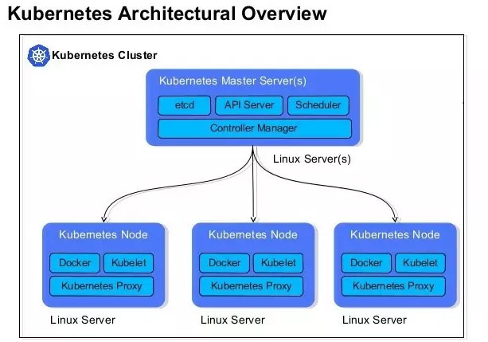

# k8s 相关

##### k8s核心组件

| 组件名             | 说明                                                         |
| ------------------ | ------------------------------------------------------------ |
| etcd               | 保存整个集群的状态                                           |
| apiserver          | 提供资源操作的唯一入口，并提供认证、授权、访问控制、api注册和发现等机制 |
| controller manager | 负责维护集群状态，比如故障检测、自动扩展、滚动更新等         |
| scheduer           | 负责资源的调度，按照预定的调度策略将pod调度到相应的机器上    |
| kubelet            | 负责维护容器的生命周期，同时负责volume（CVI）和网络（CNI）的管理 |
| container runtime  | 负责镜像管理以及pod和容器的真正运行（CRI）                   |
| kube-proxy         | 负责为service提供cluster内部的服务发现和负载均衡             |

##### 其他组件

| 组件名称              | 说明                         |
| --------------------- | ---------------------------- |
| kube-dns              | 负责为整个集群提供DNS服务    |
| ingress controller    | 为服务提供外网入口           |
| heapster              | 提供资源监控                 |
| dashboard             | 提供GUI                      |
| federation            | 提供跨可用区的集群           |
| fluentd-elasticsearch | 提供集群日志采集、存储与查询 |

