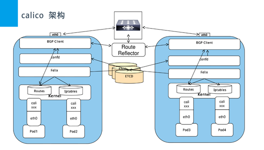

# k8s 相关

## 一、相关概念

#### 核心思想

- 资源注册
- 发现框架

#### Master节点

* ##### API Server

  * 集群控制的唯一入口，是提供Kubernets集群控制RESTful API的核心组件
  * 集群内各个组件之间数据交互和通信的中枢
  * 提供集群控制的安全机制（身份认证、授权以及admission control）

* ##### Scheduler

  * 通过API Server的Watch接口监听新建Pod副本信息，并通过调度算法为该Pod选择一个最合适的Node
  * 支持自定义调度算法provider
  * 默认调度算法内置预选策略和优选策略，决策考量资源需求、服务质量、软硬件约束、亲缘性、数据局部性等指标参数

* ##### ControllerManager

  * 集群内各种资源controller的核心管理者
  * 针对每一种具体的资源，都有相应的Controller
  * 保证其下管理的每个Controller所对应的的资源始终处于“期望状态”

* ##### Etcd

  * Kubernetes集群的主数据库，存储着所有资源对象以及状态
  * 默认与Master组件部署在一个Node上
  * Etcd的数据变更都是通过API Server进行

#### Node节点

> kubernets集群中真正的工作负载节点

* ##### Kubelet

  * 位于集群中每个Node上的非容器形式的服务进程组件，Master和Node之间的桥梁
  * 处理Master下发到本Node上的Pod创建、启停等任务管理任务；向API Server注册Node信息
  * 监控本Node上容器和节点资源情况，并定期向Master汇报节点资源占用情况

* ##### Kube-proxy

  * Service抽象概念的实现，将到Service的请求按策略（负载均衡）算法分发到后端Pod（Endpoint）上
  * 默认使用iptables mode实现
  * 支持nodeport模式，实现从外部访问集群内的service

#### k8s核心组件

| 组件名             | 说明                                                         |
| ------------------ | ------------------------------------------------------------ |
| etcd               | 保存整个集群的状态                                           |
| apiserver          | 提供资源操作的唯一入口，并提供认证、授权、访问控制、api注册和发现等机制 |
| controller manager | 负责维护集群状态，比如故障检测、自动扩展、滚动更新等         |
| scheduer           | 负责资源的调度，按照预定的调度策略将pod调度到相应的机器上    |
| kubelet            | 负责维护容器的生命周期，同时负责volume（CVI）和网络（CNI）的管理，主要负责监视指派到它所在node上的pod，包括增删改监控等 |
| container runtime  | 负责镜像管理以及pod和容器的真正运行（CRI）                   |
| kube-proxy         | 负责为service提供cluster内部的服务发现和负载均衡，负责为pod对象提供代理 |

#### 其他组件

| 组件名称              | 说明                         |
| --------------------- | ---------------------------- |
| kube-dns              | 负责为整个集群提供DNS服务    |
| ingress controller    | 为服务提供外网入口           |
| heapster              | 提供资源监控                 |
| dashboard             | 提供GUI                      |
| federation            | 提供跨可用区的集群           |
| fluentd-elasticsearch | 提供集群日志采集、存储与查询 |

#### 重要概念

* ##### Pod

  > 运行于Node节点上，若干相关容器的组合。Pod内包含的容器运行在同一宿主机上，使用相同的网络命名空间、IP地址和端口。Pod是Kubernets最基本的部署调度单元。每个Pod可以由一个或多个业务容器和一个根容器（Pause容器）组成。一个Pod表示某个应用的一个实例。
  >
  > Pod只提供容器的运行环境并保持容器的运行状态，重启容器不会造成Pod重启。
  >
  > Pod不会自愈。如果Pod运行的Node故障，或者是调度器本身故障，这个Pod就会被删除。同样的，如果Pod所在Node缺少资源或者Pod处于维护状态，Pod也会被驱逐。Kubernetes使用更高级的称为Controller的抽象层，来管理Pod实例。虽然可以直接使用Pod，但是在Kubernetes中通常是使用Controller来管理Pod的。
  >
  > Pod中共享的环境包括Linux的namespace、cgroup和其他可能的隔绝环境。

* ##### Node

  > Node节点是Kubernetes集群中的工作节点，Node上的负载由Master节点分配，工作负载主要是运行容器应用。

* ##### ReplicaSet

  > 是Pod副本的抽象，用于解决Pod的扩容和伸缩

* ##### Deployment

  > Deployment表示部署，在内部使用ReplicaSet实现。可以通过Deployment来生成相应的ReplicaSet完成Pod副本的创建。

* ##### Replication Controller

  > Replication Controller用来管理Pod的副本，保证集群中存在指定数量的Pod副本。集群中副本的数量大于指定的数量，则会停止指定数量之外的多余容器数量，反之，则会启动少于指定数量个数的容器，保证数量不变。Replication Controller是实现弹性伸缩、动态扩容和滚动升级的核心。

* ##### Service

  > Service定义了Pod的逻辑集合和访问该集合的策略，是真实服务的抽象。Service提供了一个统一的服务访问入口以及服务代理和发现机制，关联多个相同Label的Pod，用户不需要了解后台Pod是如何运行。

* ##### Label

  > Kubernets中任意API对象都是通过Label进行标识，Label的实质是一系列的Key/Value键值对。其中Key和Value由用户自己指定。Label可以附加在各种资源对象上，如Node、Pod、Service、RC等，一个资源对象可以定义任意数量的Label，同一个Label也可以被添加到任意数量的资源对象上去。Label是Replication Controller和Service运行的基础，两者通过Label来进行关联Node上运行的Pod。
  
* ##### kube-dns

  > 负责为整个集群提供DNS服务

* ##### Ingress Conroller

  > 为服务提供外网入口

* ##### Heapster

  > 提供资源监控

* ##### Dashboard

  > 提供GUI

* ##### RBAC

  > 基于角色的访问控制

  > kubernetes有一个很基本的特性就是它的所有资源对象都是模型化的 API 对象，允许执行 CRUD(Create、Read、Update、Delete)操作(也就是我们常说的增、删、改、查操作)，比如下面的这下资源：
  >
  > - Pods
  > - ConfigMaps
  > - Deployments
  > - Nodes
  > - Secrets
  > - Namespaces
  >
  > 上面这些资源对象的可能存在的操作有：
  >
  > - create
  > - get
  > - delete
  > - list
  > - update
  > - edit
  > - watch
  > - exec

### 二、网络相关

##### 1、k8s网络特征：

- 1.每个pod都有一个ip
- 2.所有pod可以通过ip访问其他pod（不管是否在同一台物理机）
- 3.Pod内的所有容器共享一个 linux net namespace，pod内的容器，都可以使用localhost来访问pod内的其他容器
- 4.所有容器可以不用nat转换访问其他容器
- 5.所有节点都可以不用nat转换与所有容器通讯
- 6.容器地址和别人看到的地址是同一个地址

##### 2、不同node中pod相互通信需要满足的条件：

- 1.整个k8s集群中的pod ip不能冲突

- 2.需要将pod ip和所在node ip关联起来，通过关联可以让pod能互访

  - 1)Node中的docker0的网桥地址不能冲突

  - 2)Pod中的数据在发出时，需要有一个机制知道对方的pod ip在哪个node上

1. 默认docker0网络为172.17.0.0/16的网段，每个容器都在这个子网内获得ip并且将docker0作为网关
2. 2.k8s中，每个node上的docker0都是可以被路由到的，也就是说，在同一个集群内，各个主机都是可以访问其他主机上的pod  ip，并不需要在主机上做端口映射。

3. 当启动pod时，同一pod下的所有容器都使用同一个网络命名空间（如：同一个ip），所以必须要使用容器网络的container模式，如果将所有pod中的容器做成一个链式的结构，中间任何一个容器出问题，都会引起连锁反映，所以在每个pod中引入了一个pause，其他容器都链接到这个容器，由pause来负责端口规划和映射。如下图：

​         k8s采用Container Networking Interface(CNI)规范。 目前Kubernetes 支持的网络方案，比如 Flannel、Calico、Canal、Weave Net 等。

##### 3、Flannel（host-gw、vxlan）

Flannel是Overlay网络的一种，也是将源数据包封装在另一种网络包里面进行路由转发和通信，目前已经支持UDP、VXLAN、AWS  VPC和GCE路由等数据转发方式。Flannel通过给每台宿主机分配一个子网的方式为容器提供虚拟网络，它基于Linux TUN/TAP，使用UDP封装IP包来创建overlay网络，并借助etcd维护网络的分配情况。

* 它给每个node上的docker容器分配互不冲突的IP地址；

* 它能给这些IP地址之间建立一个覆盖网络，通过覆盖网络，将数据包原封不动的传递到目标容器内。

##### 4、Calico（IPIP、BGP）

* 是一个纯3层的数据中心网络方案。
* Calico在每一个计算节点利用Linux Kernel实现了一个高效的vRouter来负责数据转发，而每个vRouter通过BGP协议负责把自己上运行的workload的路由信息像整个Calico网络内传播——小规模部署可以直接互联，大规模下可通过指定的BGP route reflector来完成。
* Calico节点组网可以直接利用数据中心的网络结构（无论是L2或者L3），不需要额外的NAT，隧道或者Overlay Network。
* Calico基于iptables还提供了丰富而灵活的网络Policy，保证通过各个节点上的ACLs来提供Workload的多租户隔离、安全组以及其他可达性限制等功能。

此外，Calico基于iptables还提供了丰富的网络策略，实现了k8s的Network Policy策略，提供容器间网络可达性限制的功能。

Calico的主要组件如下：

Felix：Calico Agent，运行在每台Node上，负责为容器设置网络源（IP地址、路由规则、iptables规则等），保证主机容器网络互通。

etcd：Calico使用的存储后端。

BGP Client(BIRD)：负责把Felix在各Node上设置的路由信息通过BGP协议广播到Calico网络。

BGP Route Reflector(BIRD)：通过一个或者多个BGP Route Reflector来完成大规模集群的分级路由分发。

Calicoctl：Calico命令行管理工具。

### 三、其他

##### 1、参考链接

[https://www.qikqiak.com/k8s-book/](https://www.qikqiak.com/k8s-book/)

##### 2、理解pod

##### 一：在探讨pod和容器的区别之前，我们先谈谈为什么k8s会使用pod这个最小单元，而不是使用docker的容器，k8s既然使用了pod，当然有它的理由。

------

1：更利于扩展
k8s不仅仅支持Docker容器，也支持rkt甚至用户自定义容器，为什么会有这么多不同的容器呢，因为容器并不是真正的虚拟机，docker的一些概念和误区总结，此外，Kubernetes不依赖于底层某一种具体的规则去实现容器技术，而是通过CRI这个抽象层操作容器，这样就会需要pod这样一个东西，pod内部再管理多个业务上紧密相关的用户业务容器，就会更有利用业务扩展pod而不是扩展容器。

------

2：更容易定义一组容器的状态

如果没有使用pod，而是直接使用一组容器去跑一个业务呢，那么当其中一个或者若干个容器出现问题呢，如何去定义这一组容器的状态呢，通过pod这个概念，这个问题就可以很好的解决，一组业务容器跑在一个k8s的pod中，这个pod中会有一个pause容器，这个容器与其他的业务容器都没有关系，以这个pause容器的状态来代表这个pod的状态，

------

3：利于容器间文件共享，以及通信。
pause容器有一个ip地址，和一个存储卷，pod中的其他容器共享pause容器的ip地址和存储，这样就做到了文件共享和互信。

##### 二：pod和容器的区别

总结，pod是k8s的最小单元，容器包含在pod中，一个pod中有一个pause容器和若干个业务容器，而容器就是单独的一个容器，简而言之，pod是一组容器，而容器单指一个容器。

##### 3、容器与虚拟机对比

虚拟机就像房子，容器就像胶囊公寓。

容器：容器本质是基于镜像的跨环境迁移。

容器两个特性：1、封装（配置、文件路径、权限）2、标准（无论什么容器运行环境，将同样的镜像运行起来，都可以还原当时的那一刻）

容器优势：

1.环境依赖更少

2.更轻量（虚拟机镜像大几十G上百G，容器镜像一般不到1G）

3.好移动（因为轻量所以迁移会更快，虚拟机不适合跨环境迁移）

4.启动快（没有内核、镜像小）、可以回滚、可以弹性。适合部署无状态的服务，随时重启都可以（弊端：随意重启有状态服务，不知丢失数据是什么）

5.适合于微服务（变化大、流量大）（进程多、更新快）

6.利于CI/CD，快速部署、用以轻松建立、维护、扩容和滚动更新应用程序。

容器缺点：

1.隔离性不佳

2.共享kernel

VM优势：

1.隔离全面

2.自带kernel

VM缺点：

1.镜像比较大、笨重。

2.对于跨环境迁移能力不足

推荐使用容器的场景：
1.	部署无状态的服务，同虚拟机互补使用，实现更好的隔离性
2.	如部署有状态的服务，需要对应用有一定的了解（做好health check和容错）
3.	持续集成的场景，可以顺利在开发、测试、生产之间迁移
4.	适合部署跨云、跨域、跨数据中心的混合云场景下的应用部署和弹性伸缩
5.	跨操作系统的场景
6.	应用经常变更和迭代的场景
