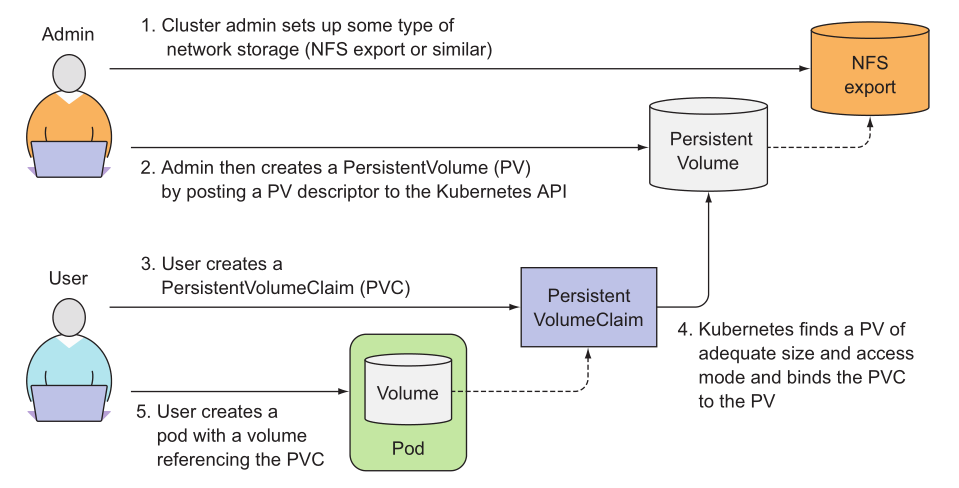

# k8s 使用 ceph 储存

### 一、介绍

[https://medium.com/velotio-perspectives/an-innovators-guide-to-kubernetes-storage-using-ceph-a4b919f4e469](https://medium.com/velotio-perspectives/an-innovators-guide-to-kubernetes-storage-using-ceph-a4b919f4e469)

##### 使用两种存储类型来与 k8s 集成

* 1、Ceph-RBD
* 2、CephFS

##### PV 与 PVC

> ​        PersistentVolume (持久卷， 简称 PV)和Persistent VolumeClaim(持久卷声明，简称 PVC)使得K8s集群具备了存储的逻辑抽象能力，使得在配置Pod的逻辑里可以忽略对实际后台存储技术的配置，而把这项配置的工作交给PV的配置者，即集群的管理者。存储的PV和PVC的这种关系，跟计算的Node和Pod的关系是非常类似的；PV和Node是资源的提供者，根据集群的基础设施变化而变化，由K8s集群管理员配置；而PVC和Pod是资源的使用者，根据业务服务的需求变化而变化，由K8s集群的使用者即服务的管理员来配置。

> ​        当集群用户需要在其pod中使用持久化存储时，他们首先创建PVC清单，指定所需要的最低容量要求和访问模式，然后用户将待久卷声明清单提交给Kubernetes API服务器，Kubernetes将找到可匹配的PV并将其绑定到PVC。PVC可以当作pod中的一个卷来使用，其他用户不能使用相同的PV，除非先通过删除PVC绑定来释放。

##### PV 的访问模型:

accessModes:

* ReadWriteOnce【简写:RWO】: 单路读写，即仅能有一个节点挂载读写，是最基本的方式，可读可写，但只支持被单个Pod挂载。
* ReadOnlyMany【ROX】: 多路只读，可以以只读的方式被多个Pod挂载。
* ReadWriteMany【RWX】：多路读写，这种存储可以以读写的方式被多个Pod共享。不是每一种存储都支持这三种方式，像共享方式，目前支持的还比较少，比较常用的是NFS。

##### **卷可以处于以下的某种状态：**

- Available（可用），一块空闲资源还没有被任何声明绑定
- Bound（已绑定），卷已经被声明绑定
- Released（已释放），声明被删除，但是资源还未被集群重新声明
- Failed（失败），该卷的自动回收失败



### 二、部署 Ceph（略）

### 三、Ceph-RBD

[https://github.com/ajaynemade/K8s-Ceph](https://github.com/ajaynemade/K8s-Ceph)

##### 1、安装 Ceph-RBD client

```
vim Ceph-RBD-Provisioner.yaml
```

```
kind: ClusterRole
apiVersion: rbac.authorization.k8s.io/v1
metadata:
  name: rbd-provisioner
rules:
  - apiGroups: [""]
    resources: ["persistentvolumes"]
    verbs: ["get", "list", "watch", "create", "delete"]
  - apiGroups: [""]
    resources: ["persistentvolumeclaims"]
    verbs: ["get", "list", "watch", "update"]
  - apiGroups: ["storage.k8s.io"]
    resources: ["storageclasses"]
    verbs: ["get", "list", "watch"]
  - apiGroups: [""]
    resources: ["events"]
    verbs: ["create", "update", "patch"]
  - apiGroups: [""]
    resources: ["services"]
    resourceNames: ["kube-dns","coredns"]
    verbs: ["list", "get"]
  - apiGroups: [""]
    resources: ["endpoints"]
    verbs: ["get", "list", "watch", "create", "update", "patch"]
---
kind: ClusterRoleBinding
apiVersion: rbac.authorization.k8s.io/v1
metadata:
  name: rbd-provisioner
subjects:
  - kind: ServiceAccount
    name: rbd-provisioner
    namespace: kube-system
roleRef:
  kind: ClusterRole
  name: rbd-provisioner
  apiGroup: rbac.authorization.k8s.io
---
apiVersion: rbac.authorization.k8s.io/v1beta1
kind: Role
metadata:
  name: rbd-provisioner
rules:
- apiGroups: [""]
  resources: ["secrets"]
  verbs: ["get"]
---
apiVersion: rbac.authorization.k8s.io/v1
kind: RoleBinding
metadata:
  name: rbd-provisioner
roleRef:
  apiGroup: rbac.authorization.k8s.io
  kind: Role
  name: rbd-provisioner
subjects:
- kind: ServiceAccount
  name: rbd-provisioner
  namespace: kube-system
---
apiVersion: v1
kind: ServiceAccount
metadata:
  name: rbd-provisioner
---
apiVersion: extensions/v1beta1
kind: Deployment
metadata:
  name: rbd-provisioner
spec:
  replicas: 1
  strategy:
    type: Recreate
  template:
    metadata:
      labels:
        app: rbd-provisioner
    spec:
      containers:
      - name: rbd-provisioner
        image: "quay.io/external_storage/rbd-provisioner:latest"
        env:
        - name: PROVISIONER_NAME
          value: ceph.com/rbd
      serviceAccount: rbd-provisioner
```

```
kubectl create -n kube-system -f  Ceph-RBD-Provisioner.yaml
```

> output

```
clusterrole.rbac.authorization.k8s.io/rbd-provisioner created
clusterrolebinding.rbac.authorization.k8s.io/rbd-provisioner created
role.rbac.authorization.k8s.io/rbd-provisioner created
rolebinding.rbac.authorization.k8s.io/rbd-provisioner created
serviceaccount/rbd-provisioner created
deployment.extensions/rbd-provisioner created
```

##### 2、检查 RBD volume 状态，等待状态为 Running

```
kubectl get pods -l app=rbd-provisioner -n kube-system
NAME                               READY     STATUS    RESTARTS   AGE
rbd-provisioner-857866b5b7-vc4pr   1/1       Running   0          16s
```

##### 3、等待运行起来过后，配置 admin key 作为认证

```
ceph auth get-key client.admin
AQDyWw9dOUm/FhAA4JCA9PXkPo6+OXpOj9N2ZQ==

kubectl create secret generic ceph-secret \
    --type="kubernetes.io/rbd" \
    --from-literal=key='AQDyWw9dOUm/FhAA4JCA9PXkPo6+OXpOj9N2ZQ==' \
    --namespace=kube-system
```

##### 4、为 k8s 创建一个 ceph pool，并且创建一个 client key

```
ceph --cluster ceph osd pool create kube 1024 1024

ceph --cluster ceph auth get-or-create client.kube mon 'allow r' osd 'allow rwx pool=kube'
```

##### 5、获取创建的 auth token，并且为 kube pool 创建 k8s secret

```
ceph --cluster ceph auth get-key client.kube
AQDabg9d4MBeIBAAaOhTjqsYpsNa4X10V0qCfw==

kubectl create secret generic ceph-secret-kube \
    --type="kubernetes.io/rbd" \
    --from-literal=key="AQDabg9d4MBeIBAAaOhTjqsYpsNa4X10V0qCfw==" \
    --namespace=kube-system
```

#####  6、创建存储 class

```
vim Ceph-RBD-StorageClass.yaml
```

```
apiVersion: storage.k8s.io/v1
kind: StorageClass
metadata:
  name: fast-rbd
provisioner: ceph.com/rbd
# allowVolumeExpansion: true
parameters:
  monitors: 10.0.1.118:6789, 10.0.1.227:6789, 10.0.1.172:6789
  adminId: admin
  adminSecretName: ceph-secret
  adminSecretNamespace: kube-system
  pool: kube
  userId: kube
  userSecretName: ceph-secret-kube
  userSecretNamespace: kube-system
  imageFormat: "2"
  imageFeatures: layering 
```

```
kubectl create -f Ceph-RBD-StorageClass.yaml
```

> allowVolumeExpansion: true，允许扩容
>
> bug：需要在pod/kube-controller-manager中安装ceph-mon，并拷贝ceph.client.admin.keyring到/etc/ceph/文件夹中。
>
> 如下编辑pvc，再重启pod即可实现扩容
>
> kubectl edit pvc data-kafka-0
>
> status:
>   accessModes:
>   - ReadWriteOnce
>     storage: 8Gi

##### 7、到此已经配置完。接下来通过创建 PVC 来测试 Ceph-RBD。

```
vim Ceph-RBD-PVC.yaml
```

```
kind: PersistentVolumeClaim
apiVersion: v1
metadata:
  name: testclaim
spec:
  accessModes:
    - ReadWriteOnce
  resources:
    requests:
      storage: 1Gi
  storageClassName: fast-rbd
```

```
kubectl create -f Ceph-RBD-PVC.yaml
```

##### 8、检查pvc，就会发现它表明它已与存储类创建的pv绑定。

```
kubectl get pvc
NAME      STATUS    VOLUME                                     CAPACITY   ACCESS MODES   STORAGECLASS   AGE
testclaim  Bound     pvc-c215ad98-95b3-11e9-8b5d-12e154d66096   1Gi        RWO            fast-rbd       2m
```

##### 9、检查 persistent volume（pv）

```
kubectl get pv
NAME                                       CAPACITY   ACCESS MODES   RECLAIM POLICY   STATUS    CLAIM             STORAGECLASS   REASON    AGE
pvc-c215ad98-95b3-11e9-8b5d-12e154d66096   1Gi        RWO            Delete           Bound     default/testclaim   fast-rbd                 8m
```

### 四、CephFS

##### 1、创建一个单独的命名空间

```
kubectl create ns cephfs
```

##### 2、使用 ceph admin auth token，创建 k8s secret

```
ceph auth get-key client.admin
AQDyWw9dOUm/FhAA4JCA9PXkPo6+OXpOj9N2ZQ==

kubectl create secret generic ceph-secret-admin --from-literal=key="AQDyWw9dOUm/FhAA4JCA9PXkPo6+OXpOj9N2ZQ==" -n cephfs
```

##### 3、创建 cluster role、role bonding、provisioner

```
vim Ceph-FS-Provisioner.yaml
```

```
kind: ClusterRole
apiVersion: rbac.authorization.k8s.io/v1
metadata:
  name: cephfs-provisioner
  namespace: cephfs
rules:
  - apiGroups: [""]
    resources: ["persistentvolumes"]
    verbs: ["get", "list", "watch", "create", "delete"]
  - apiGroups: [""]
    resources: ["persistentvolumeclaims"]
    verbs: ["get", "list", "watch", "update"]
  - apiGroups: ["storage.k8s.io"]
    resources: ["storageclasses"]
    verbs: ["get", "list", "watch"]
  - apiGroups: [""]
    resources: ["events"]
    verbs: ["create", "update", "patch"]
  - apiGroups: [""]
    resources: ["services"]
    resourceNames: ["kube-dns","coredns"]
    verbs: ["list", "get"]
---
kind: ClusterRoleBinding
apiVersion: rbac.authorization.k8s.io/v1
metadata:
  name: cephfs-provisioner
subjects:
  - kind: ServiceAccount
    name: cephfs-provisioner
    namespace: cephfs
roleRef:
  kind: ClusterRole
  name: cephfs-provisioner
  apiGroup: rbac.authorization.k8s.io
---
apiVersion: rbac.authorization.k8s.io/v1
kind: Role
metadata:
  name: cephfs-provisioner
  namespace: cephfs
rules:
  - apiGroups: [""]
    resources: ["secrets"]
    verbs: ["create", "get", "delete"]
  - apiGroups: [""]
    resources: ["endpoints"]
    verbs: ["get", "list", "watch", "create", "update", "patch"]
---
apiVersion: rbac.authorization.k8s.io/v1
kind: RoleBinding
metadata:
  name: cephfs-provisioner
  namespace: cephfs
roleRef:
  apiGroup: rbac.authorization.k8s.io
  kind: Role
  name: cephfs-provisioner
subjects:
- kind: ServiceAccount
  name: cephfs-provisioner
---
apiVersion: v1
kind: ServiceAccount
metadata:
  name: cephfs-provisioner
  namespace: cephfs
---
apiVersion: extensions/v1beta1
kind: Deployment
metadata:
  name: cephfs-provisioner
  namespace: cephfs
spec:
  replicas: 1
  strategy:
    type: Recreate
  template:
    metadata:
      labels:
        app: cephfs-provisioner
    spec:
      containers:
      - name: cephfs-provisioner
        image: "quay.io/external_storage/cephfs-provisioner:latest"
        env:
        - name: PROVISIONER_NAME
          value: ceph.com/cephfs
        - name: PROVISIONER_SECRET_NAMESPACE
          value: cephfs
        command:
        - "/usr/local/bin/cephfs-provisioner"
        args:
        - "-id=cephfs-provisioner-1"
      serviceAccount: cephfs-provisioner
```

```
kubectl create -n cephfs -f Ceph-FS-Provisioner.yaml
```

##### 4、创建 storage class

```
vim Ceph-FS-StorageClass.yaml
```

```
kind: StorageClass
apiVersion: storage.k8s.io/v1
metadata:
  name: cephfs
provisioner: ceph.com/cephfs
parameters:
    monitors: 10.0.1.226:6789, 10.0.1.205:6789, 10.0.1.82:6789
    adminId: admin
    adminSecretName: ceph-secret-admin
    adminSecretNamespace: cephfs
    claimRoot: /pvc-volumes
```

```
kubectl create -f Ceph-FS-StorageClass.yaml
```

##### 5、到此配置完成。等待状态变为 Running

```
kubectl get pods -n cephfs
NAME                                 READY     STATUS    RESTARTS   AGE
cephfs-provisioner-8d957f95f-s7mdq   1/1       Running   0          1m
```

##### 6、CephFS提供程序启动后，请尝试创建持久卷声明。 在此步骤中，存储类将负责动态创建持久卷。

```
vim Ceph-FS-PVC.yaml
```

```
kind: PersistentVolumeClaim
apiVersion: v1
metadata:
  name: claim1
spec:
  storageClassName: cephfs
  accessModes:
    - ReadWriteMany
  resources:
    requests:
      storage: 1Gi
```

```
kubectl create -f Ceph-FS-PVC.yaml
```

##### 7、检查 pv 和 pvc

```
kubectl get pvc
NAME      STATUS    VOLUME                                     CAPACITY   ACCESS MODES   STORAGECLASS   AGE
claim1    Bound     pvc-a7db18a7-9641-11e9-ab86-12e154d66096   1Gi        RWX            cephfs         2m

kubectl get pv
NAME                                       CAPACITY   ACCESS MODES   RECLAIM POLICY   STATUS    CLAIM            STORAGECLASS   REASON    AGE
pvc-a7db18a7-9641-11e9-ab86-12e154d66096   1Gi        RWX            Delete           Bound     default/claim1   cephfs                   2m
```

### 五、测试 CephFS
##### 1、创建 pvc

```
vim cephfs-pvc-test.yaml
```

```
kind: PersistentVolumeClaim
apiVersion: v1
metadata:
  name: cephfs-claim
spec:
  accessModes:     
    - ReadWriteOnce
  storageClassName: dynamic-cephfs
  resources:
    requests:
      storage: 2Gi
```

```
kubectl apply -f cephfs-pvc-test.yaml
```
##### 2、查看

```javascript
kubectl get pvc
kubectl get pv
```
##### 3、创建 nginx pod 挂载测试

```
vim nginx-pod.yaml
```

```
apiVersion: v1
kind: Pod
metadata:
  name: nginx-pod1
  labels:
    name: nginx-pod1
spec:
  containers:
  - name: nginx-pod1
    image: nginx:alpine
    ports:
    - name: web
      containerPort: 80
    volumeMounts:
    - name: ceph-rdb
      mountPath: /usr/share/nginx/html
  volumes:
  - name: ceph-rdb
    persistentVolumeClaim:
      claimName: cephfs-claim
```

```
kubectl apply -f nginx-pod.yaml
```

##### 4、查看

```
kubectl get pods -o wide
```
##### 5、修改访问内容

```
kubectl exec -ti nginx-pod1 -- /bin/sh -c 'echo Hello World from Ceph RBD!!! > /usr/share/nginx/html/index.html'
```
##### 6、访问测试

```
POD_ID=$(kubectl get pods -o wide | grep nginx-pod1 | awk '{print $6}')
curl http://$POD_ID
```
##### 7、清理

```
kubectl delete -f nginx-pod.yaml
kubectl delete -f cephfs-pvc-test.yaml
```

### 六、测试  Ceph-RBD

```
# 创建pvc测试
cat >ceph-rdb-pvc-test.yaml<<EOF
kind: PersistentVolumeClaim
apiVersion: v1
metadata:
  name: ceph-rdb-claim
spec:
  accessModes:     
    - ReadWriteOnce
  storageClassName: dynamic-ceph-rdb
  resources:
    requests:
      storage: 2Gi
EOF
kubectl apply -f ceph-rdb-pvc-test.yaml
 
# 查看
kubectl get pvc
kubectl get pv
 
# 创建 nginx pod 挂载测试
cat >nginx-pod.yaml<<EOF
apiVersion: v1
kind: Pod
metadata:
  name: nginx-pod1
  labels:
    name: nginx-pod1
spec:
  containers:
  - name: nginx-pod1
    image: nginx:alpine
    ports:
    - name: web
      containerPort: 80
    volumeMounts:
    - name: ceph-rdb
      mountPath: /usr/share/nginx/html
  volumes:
  - name: ceph-rdb
    persistentVolumeClaim:
      claimName: ceph-rdb-claim
EOF
kubectl apply -f nginx-pod.yaml
 
# 查看
kubectl get pods -o wide
 
# 修改文件内容
kubectl exec -ti nginx-pod1 -- /bin/sh -c 'echo Hello World from Ceph RBD!!! > /usr/share/nginx/html/index.html'
 
# 访问测试
POD_ID=$(kubectl get pods -o wide | grep nginx-pod1 | awk '{print $6}')
curl http://$POD_ID

# 清理
kubectl delete -f nginx-pod.yaml
kubectl delete -f ceph-rdb-pvc-test.yaml
```

