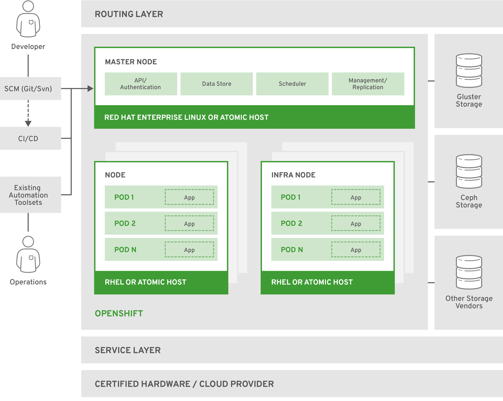

# openshift 相关



* Master Node提供的组件：API Server (负责处理客户端请求, 包括node、user、administrator和其他的infrastructure系统)；Controller Manager Server (包括scheduler和replication controller)；OpenShift客户端工具 (oc)

* Compute Node(Application Node) 部署application
* Infra Node 运行router、image registry和其他的infrastructure服务(由管理员安装的系统服务Application)
* etcd 可以部署在Master Node，也可以单独部署， 用来存储共享数据：master state、image、 build、deployment metadata等
* Pod 最小的Kubernetes object，可以部署一个或多个container

[https://blog.51cto.com/7308310/2171091](https://blog.51cto.com/7308310/2171091)

## 一、单节点部署3.11

##### 1、安装相关软件

```
yum -y install epel-release git python-pip gcc python-devel centos-release-openshift-origin311
```

##### 2、下载源码

[https://github.com/openshift/openshift-ansible/tree/v3.11](https://github.com/openshift/openshift-ansible/tree/v3.11)

```
git clone https://github.com/openshift/openshift-ansible.git
cd openshift-ansible
git tag
git checkout v3.11
git describe
```

##### 3、修改依赖ansible的版本为2.7.x

```
vim requirements.txt
ansible==2.7.12
```

##### 4、安装依赖

```
pip install -r requirements.txt -i https://pypi.tuna.tsinghua.edu.cn/simple
```

##### 5、编写hosts.localhost

```
cat inventory/hosts.localhost

#bare minimum hostfile

[OSEv3:children]
masters
nodes
etcd

[OSEv3:vars]
# if your target hosts are Fedora uncomment this
#ansible_python_interpreter=/usr/bin/python3
openshift_deployment_type=origin
openshift_portal_net=172.30.0.0/16
# localhost likely doesn't meet the minimum requirements
openshift_disable_check=disk_availability,memory_availability,docker_image_availability,docker_storage

openshift_node_groups=[{'name': 'node-config-all-in-one', 'labels': ['node-role.kubernetes.io/master=true', 'node-role.kubernetes.io/infra=true', 'node-role.kubernetes.io/compute=true']}]

[masters]
localhost ansible_connection=local

[etcd]
localhost ansible_connection=local

[nodes]
# openshift_node_group_name should refer to a dictionary with matching key of name in list openshift_node_groups.
localhost ansible_connection=local openshift_node_group_name="node-config-all-in-one"
```

##### 6、做好本地对自己的免密，修改hosts文件

```
cat /etc/hosts

192.168.21.90 hl

ssh-keygen
ssh-copy-id hl
```

##### 7、准备

```
ansible-playbook -i inventory/hosts.localhost playbooks/prerequisites.yml
```

##### 8、修改openshift源

```
[centos-openshift-origin311]
name=CentOS OpenShift Origin
baseurl=http://buildlogs.centos.org/centos/7/paas/x86_64/openshift-origin311/
enabled=1
gpgcheck=0
gpgkey=file:///etc/pki/rpm-gpg/RPM-GPG-KEY-CentOS-SIG-PaaS

[centos-openshift-origin311-testing]
name=CentOS OpenShift Origin Testing
baseurl=http://buildlogs.centos.org/centos/7/paas/x86_64/openshift-origin311/
enabled=0
gpgcheck=0
gpgkey=file:///etc/pki/rpm-gpg/RPM-GPG-KEY-CentOS-SIG-PaaS

[centos-openshift-origin311-debuginfo]
name=CentOS OpenShift Origin DebugInfo
baseurl=http://debuginfo.centos.org/centos/7/paas/x86_64/
enabled=0
gpgcheck=0
gpgkey=file:///etc/pki/rpm-gpg/RPM-GPG-KEY-CentOS-SIG-PaaS

[centos-openshift-origin311-source]
name=CentOS OpenShift Origin Source
baseurl=http://vault.centos.org/centos/7/paas/Source/openshift-origin311/
enabled=0
gpgcheck=0
gpgkey=file:///etc/pki/rpm-gpg/RPM-GPG-KEY-CentOS-SIG-PaaS
```

```
yum makecache fast
```

##### 9、提前拉取镜像（deploy_cluster.yml会拉取）

```
imgs=(docker.io/cockpit/kubernetes:latest docker.io/openshift/origin-control-plane:v3.11 docker.io/openshift/origin-deployer:v3.11 docker.io/openshift/origin-docker-registry:v3.11 docker.io/openshift/origin-pod:v3.11 quay.io/coreos/etcd:v3.2.22 docker.io/openshift/origin-haproxy-router:v3.11 docker.io/openshift/origin-control-plane:v3.11.0 docker.io/openshift/origin-deployer:v3.11.0 docker.io/openshift/origin-haproxy-router:v3.11.0 docker.io/openshift/origin-pod:v3.11.0  docker.io/openshift/origin-docker-registry:v3.11.0)

for img in ${imgs[@]};do docker pull $img;done
```

##### 10、提前安装相关软件（deploy_cluster.yml会安装）

```
yum -y install origin-node-3.11* origin-clients-3.11* origin-3.11* conntrack-tools
```

##### 11、部署

```
ansible-playbook -i inventory/hosts.localhost  playbooks/deploy_cluster.yml
```

##### 12、卸载（部署失败是可用，从第7步重新开始）

```
ansible-playbook playbooks/adhoc/uninstall_openshift.yml
```

##### 13、创建管理用户和密码

```
htpasswd -c /etc/origin/master/htpasswd admin
```

##### 14、登录

```
https://yani.srv.world:8443/console
```

## 二、多节点部署

[配置calico](https://docs.projectcalico.org/v3.7/getting-started/openshift/installation)

##### 1、hosts文件

```
[OSEv3:children]
masters
nodes
etcd
nfs

[OSEv3:vars]
ansible_ssh_user=root
# If ansible_ssh_user is not root, ansible_become must be set to true
#ansible_become=true
openshift_deployment_type=origin

# openshift version
openshift_image_tag=v3.11
openshift_release=v3.11

# use calico
os_sdn_network_plugin_name=cni
openshift_use_calico=true
openshift_use_openshift_sdn=false

openshift_master_identity_providers=[{'name': 'htpasswd_auth', 'login': 'true', 'challenge': 'true', 'kind': 'HTPasswdPasswordIdentityProvider'}]
#openshift_master_htpasswd_users={'admin': '$apr1$RbOvaj8r$LEqJqG6V/O/i7Pfyyyyyy.', 'user': '$apr1$MfsFK97I$enQjqHCh2LL8w4EBwNrrrr'}
openshift_master_default_subdomain=apps.srv.world
# allow unencrypted connection within cluster
openshift_docker_insecure_registries=172.30.0.0/16
#openshift_disable_check=disk_availability,docker_storage,memory_availability,docker_image_availability
openshift_disable_check=docker_storage,docker_image_availability

[masters]
master.srv.world openshift_schedulable=true containerized=false

[etcd]
master.srv.world

[nfs]
master.srv.world

[nodes]
# defined values for [openshift_node_group_name] in the file below
# [/usr/share/ansible/openshift-ansible/roles/openshift_facts/defaults/main.yml]
#master.srv.world openshift_node_group_name='node-config-master-infra'
#master.srv.world openshift_node_group_name='node-config-master'
#node2.srv.world openshift_node_group_name='node-config-infra'
#master.srv.world openshift_node_group_name='node-config-all-in-one'

master.srv.world openshift_node_group_name='node-config-master-infra'
node1.srv.world openshift_node_group_name='node-config-compute'
```

##### 2、安装calicoctl客户端

```
curl -O -L https://github.com/projectcalico/calicoctl/releases/download/v3.1.3/calicoctl
chmod a+x calicoctl
mv calicoctl /bin
calicoctl node status
```


##### 3、nfs
```
[root@ctrl ~]# cat /etc/exports
/var/nfsshare *(rw,sync,no_subtree_check,no_root_squash)
```

```
git clone https://github.com/kubernetes-incubator/external-storage.git
cd external-storage/nfs-client
# https://medium.com/faun/openshift-dynamic-nfs-persistent-volume-using-nfs-client-provisioner-fcbb8c9344e
# https://github.com/kubernetes-incubator/external-storage/blob/master/nfs-client/README.md
kubectl patch storageclass managed-nfs-storage -p '{"metadata": {"annotations":{"storageclass.kubernetes.io/is-default-class":"true"}}}'
```

##### 4、若要更改网络相关，还需要删除cni相关的配置文件

```
rm -rf /etc/cni/net.d/*
```

## 三、使用

##### 1、查看节点信息

```
oc get nodes
oc get nodes --show-labels=true
```

##### 2、oc client tool

```
oc whoami
system:admin

在其他节点运行oc命令需要先登录
oc login https://yani.srv.world:8443 -u developer

退出
os logout
```

##### 3、查看openshift资源类型

```
oc api-resources
```

##### 4、查看pod

```
oc get pods
```

##### 5、查看pod详细信息

```
oc describe pods
```

