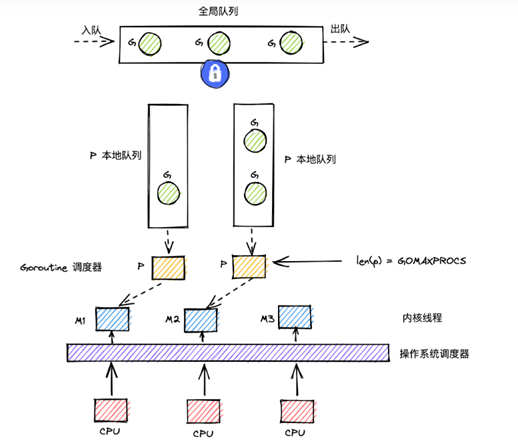

# Go 语言相关

# 一、并发

## 1、GMP模型




> GMP：机制是实现协程和并发的重要机制。
>
> GMP机制采用了M:N模型，M个goroutine映射到N个OS thread上执行。

golang中有一个协程的概念，更轻量级的调度单元。

* 占用栈空间小（2KB～2GB）
* 上下文都在用户态切换，不会涉及到内核态
* 协程切换速度大约1～2微秒，golang中协程切换速度为0.2微秒左右。

### GMP的模型如何设计？

> 全局队列：当P中的本地队列中有协程G溢出时，会被放到全局队列中。
>
> P的本地队列：P内置的G队列，存的数量不超过256个。
>
> 一、当队列P1中的G1在运行过程中新建G2时，G2优先存放在P1的本地队列中，如果队列满了，则会把P1队列中一半的G移动到全局队列。
>
> 二、如果P的本地队列为空，那么他会先到全局队列中获取G，如果全局队列中没有G，则会尝试从其他线程绑定的P中偷取一半的G。

### g

1、g是goroutine，是对协程的抽象，是一种轻量级的线程实现，可以在单个线程中同时运行多个协程，从而实现并发执行。

2、g有自己的运行栈、状态、以及执行的任务函数（用户通过go func指定）

3、g需要绑定到p才能执行，在g的视角中，p是它的cpu

4、G需要调度到M上才能运行，M是真正的执行者，调度器最多可以创建1万个线程。

5、当一个goroutine阻塞或执行完毕时，对应的m会返回给p，p将m标记为空闲状态，并从队列中取出下一个goroutine映射到该m上执行。


goroutin有三个状态：

* Waiting：goroutine正在等待systemcall执行完毕，或正在等待锁。
* Runable：goroutine想要在M上执行指令。
* Executing：goroutine正在M上执行指令当中。

### p

1、p是调度器Processor，联系g与m

2、p的数量决定了g最大并行数量，可由用户通过GOMAXPROCS进行设定（超过CPU核数无意义）

3、go语言中的中阶层，负责将goroutine映射到m(OS thread)上执行，同时也负责调度和管理m(OS thread)。

4、p负责协程的调度和管理，维护了一个goroutine队列，用于存储待执行的goroutine，当一个goroutine需要执行时，p会从队列中取出一个goroutine，并将其映射到一个空闲的m上执行。

5、p的数量由启动时环境变量$GOMAXPROCS或者由runtime的方法GOMAXPROCS()决定，因为M需要和P绑定才能运行G，P的个数取决于设置的GOMAXPROCS，默认被设置为可用的CPU核数。

### m

1、m是machine是go中线程的抽象

2、m不直接执行g，而是先和p绑定，由其实现代理

3、借由p的存在，m无需和g绑死，也无需记录g的状态信息，因此g在全生命周期中可实现跨m执行

4、操作系统中的线程实现，是操作系统调度和管理的最小执行单元，可以执行计算任务和系统调用等操作。

5、M的数量和P不一定匹配，可以设置很多M，M和P绑定才可运行，多余的M处于休眠状态。

6、m的数量，go程序启动时，会设置m的最大数量，默认10000，但是内核很难创建出这么多线程，因此默认情况下m的最大数量取决于内核。也可以调用runtime/debug中的SetMaxThreads函数 ，手动设置m的最大数量。

### P和M都是程序运行时就被创建好了的吗？

P和M创建时间不同。

P：在确定P的最大数量n后，运行时系统会根据这个数量创建n个P。

M：内核级线程的初始化是由内核管理的，当没有足够的M来关联P并运行其中的可运行的G时会请求创建新的M。比如M在运行G1时被阻塞了，此时需要新的M去绑定P，如果没有在休眠的M则需要新建M。

### G在MP模型中流动过程？

1、调用go func()创建一个goroutine。

2、新创建的G优先保存在P的本地队列中，如果P的本地队列已经满了就会保存在全局队列中。

3、M需要在P的本地队列弹出一个可执行的G，如果P的本地队列为空，则先会去全局队列在中获取G，如果全局队列也为空则去其他P中偷取一半的G放到自己的P中。

4、G将相关参数传输给M，为M执行G做准备。

5、当M执行某一个G时，如果发生了系统调用会导致M阻塞，如果当前P队列中有一些G，runtime会将线程M和P分离，然后再获取空闲的线程或创建一个新的内核级线程来服务这个P，阻塞调用完成后G被销毁将值返回。

6、销毁G，将执行结果返回。

7、当M系统调用结束后，这个M会尝试获取一个空闲的P执行，如果获取不到P，那么这个线程M变成休眠状态，加入到空闲线程。

## 2、并发

> 并发：相继发生，同一时间间隔发生
>
> 并行：同时进行，同一时刻

## 3、sync

### 1.sync.Mutex互斥锁

保证同一时间只有一个goroutine可以获取锁，从而实现对共享资源的互斥访问。

* Lock 获取锁，会阻塞直到获取锁为止
* Unlock释放锁
* TryLock尝试获取锁，如果锁已经被占用则不会等待直接返回

```
var count int
var mutex sync.Mutex

func increase() {
    mutex.Lock()
    defer mutex.Unlock()

    count++
}
```

### 2.sync.RWMutex读写互斥锁

提供更细粒度的读写访问控制。

* RLock获取锁
* RUnlock释放读锁
* Lock获取写锁
* Unlock释放写锁

```
var count int
var rwMutex sync.RWMutex

func read() {
    rwMutex.RLock()
    defer rwMutex.RUnlock()

    print(count)
}

func write() {
    rwMutex.Lock()
    defer rwMutex.Unlock()

    count++
}
```

### 3.sync.WaitGroup等待组

用于等待一组goroutine结束后再继续执行

* Add添加一个等待单位
* Done表示一个等待单位完成
* Wait阻塞直到所有等待单位完成

```

var wg sync.WaitGroup

func worker() {
    defer wg.Done()
    // do work
}

wg.Add(1)
go worker()
wg.Wait() // 等待worker完成
```

### 4.sync.Once一次性初始化

提供一次性初始化的功能，确保某个初始化逻辑只执行一次。单例模式。

```
var once sync.Once
var config *Config

func initialize() {
    config = loadConfig()
}

func GetConfig() *Config {
    once.Do(initialize)
    return config
}
```

### 5.sync.Map线程安全nao

一个可以并发安全使用的map

内部使用锁机制来保证并发安全，相比传统map有更好的扩展性。

```
var configMap sync.Map

configMap.Store("timeout", 500)

if _, ok := configMap.Load("timeout"); ok {
// 使用超时
}
```

### 6.sync.Pool对象池

实现了一个可以重用的对象池

对象池可以有效的减少对象频繁创建和销毁的性能开销

```
var bufferPool sync.Pool

func NewBuffer() *Buffer {
v := bufferPool.Get()
if v == nil {
    return &Buffer{} 
}
    return v.(*Buffer)
}

bufferPool.Put(b)

bufferPool.Get()
```

### 实现一个阻塞式的消息队列，支持多个接受者

```
type MessageQueue struct {
    queue []interface{}
    mutex sync.RWMutex
}

func NewMessageQueue() *MessageQueue {
    return &MessageQueue{queue: make([]interface{}, 0)}
}

func (q *MessageQueue) Enqueue(msg interface{}) {
    q.mutex.Lock()
    defer q.mutex.Unlock()

    q.queue = append(q.queue, msg)
}

func (q *MessageQueue) Dequeue() interface{} {
    q.mutex.RLock()
    defer q.mutex.RUnlock()

    // 获取首元素
    msg := q.queue[0]
    q.queue = q.queue[1:]
    return msg
}
```

# 二、反射


# 二、GC


# 三、struct


# 四、Interface


# 常用包


## 1、Sync


## big


## os

1.os.Args 获取命令行参数

```
args[0]永远都是程序本身的路径,args[1:]包含所有参数。


for _, arg := range os.Args[1:] {
    fmt.Println(arg) 
}
```

2.os.Create 创建文件

```
file, err := os.Create("test.txt")
if err != nil {
    return err
}
defer file.Close()
```

3.os.Open 打开文件

```
file, err := os.Open("test.txt") 
if err != nil {
    return err
}
defer file.Close()
```

4.os.StartProcess启动新进程

```
executable := "/path/to/test"
args := []string{"-a", "123"}

attr := &os.ProcAttr{
	Files: []*os.File{os.Stdin, os.Stdout, os.Stderr},
}

_, err := os.StartProcess(executable, args, attr)
```

5.os.Getenv 获取环境变量

6.os.Chdir切换当前工作目录

7.os.Mkdir 创建目录

```
func main() {
  err := os.Mkdir("testdir", 0755)

  if err != nil {
    log.Fatal(err)
  }

}
```

8.os.Remove 删除文件

9.os.Rename 重命名文件

10.os.Truncate 可以对文件进行截断,使得文件只保留截断之前的内容。

```
func main() {
  f, err := os.OpenFile("test.txt", os.O_RDWR, 0644)
  if err != nil {
    log.Fatal(err)
  }
  defer f.Close()

  err = os.Truncate("test.txt", 10)
  if err != nil {
    log.Fatal(err)
  }
}
```

11.os.TempDir 可以获取当前系统的临时文件目录。

12.os.Getwd 可以获取当前进程的工作目录。

13.os.Hostname 可以获取主机的名称。

14.os.Environ 获取环境变量

```
env := os.Environ()
for _, v := range env {
    fmt.Println(v)
}
```

15.os.Exit 退出当前进程

16.os.IsExist 判断文件或文件夹是否存在

```
func main() {
  if _, err := os.Stat("/path/to/file"); os.IsNotExist(err) {
    fmt.Println("file does not exist")
  }
}
```

17.os.Stat 获取文件信息

```
info, err := os.Stat("test.txt")
if err != nil {
    log.Fatal(err)
}
fmt.Println(info.Size()) // 文件大小
```

18.os.ReadFile 读取整个文件

```
data, err := os.ReadFile("test.txt") 
if err != nil {
    log.Fatal(err)
   
}
fmt.Print(string(data))
```

19.os.WriteFile 写入文件

```
data := []byte("Hello World") 

err := os.WriteFile("data.txt", data, 0644)

if err != nil {
    log.Fatal(err)
}
```

## time

创建和获取时间

```
package main

import (
  "fmt"
  "time"
)

func main() {
  // 获取当前时间
  now := time.Now()
  fmt.Println("Current time:", now)

  // 创建指定时间
  specificTime :=
    time.Date(2023, time.October, 25, 22, 30, 0, 0, time.UTC)

  fmt.Println("Specific time:", specificTime)
}
```

时间的格式化与解析

```
package main

import (
  "fmt"
  "time"
)

func main() {
  // 时间格式化
  now := time.Now()

  formattedTime := now.Format("2006-01-02 15:04:05")

  fmt.Println("Formatted time:", formattedTime)

  // 时间解析
  parsedTime, err :=
    time.Parse("2006-01-02 15:04:05", "2023-10-25 22:30:12")

  if err != nil {
    fmt.Println("Error:", err)
    return
  }

  fmt.Println("Parsed time:", parsedTime)
}
```

时区处理与转换

```
package main

import (
  "fmt"
  "time"
)

func main() {
  // 获取时区
  local := time.Now()

  fmt.Println("Local time:", local)

  // 转换时区
  shanghaiTimeZone, err :=
    time.LoadLocation("Asia/Shanghai")

  if err != nil {
    fmt.Println("Error:", err)
    return
  }

  ShanghaiTime := local.In(shanghaiTimeZone)

  fmt.Println("Shanghai time:", ShanghaiTime)
}
```

定时器与超时控制

```
package main

import (
  "fmt"
  "time"
)

func main() {
  // 创建定时器，等待2秒
  timer := time.NewTimer(2 * time.Second)

  // 等待定时器触发
  <-timer.C
  fmt.Println("Timer expired!")
}
```

时间间隔与持续时间

```

package main

import (
  "fmt"
  "time"
)

func main() {
  // 计算时间间隔
  start := time.Now()

  time.Sleep(2 * time.Second)

  end := time.Now()

  duration := end.Sub(start)
  
  fmt.Println("Duration:", duration)
}
```

时间的比较与计算

```
package main

import (
  "fmt"
  "time"
)

func main() {
  // 比较时间
  time1 :=
    time.Date(2023, time.October, 25, 19, 0, 0, 0, time.UTC)

  time2 :=
    time.Date(2023, time.October, 25, 22, 0, 0, 0, time.UTC)

  if time1.Before(time2) {
    fmt.Println("time1 is before time2.")
  }

  // 计算时间
  diff := time2.Sub(time1)

  fmt.Println("Time difference:", diff)
}
```

## Context


## flag


## log


## IO


# 一、常用

## 1、调试显示代码位置

```
log.SetFlags(log.Llongfile)
log.Print("") 
```

```
  where := func() {
    _, file, line, _ := runtime.Caller(1)
    log.Printf("%s:%d", file, line)
  }
  where()
```

## 2、go mod

```
go mod download  下载依赖的module到本地cache（默认为$GOPATH/pkg/mod目录）
go mod edit      编辑go.mod文件
go mod graph     打印模块依赖图
go mod init      初始化当前文件夹, 创建go.mod文件
go mod tidy      增加缺少的module，删除无用的module
go mod vendor    将依赖复制到vendor下
go mod verify    校验依赖
go mod why       解释为什么需要依赖
```

## 3、清理缓存

```
go clean -modcache
rm -rf mod.sum
go mod tidy
```

## 4、go.mod replace 本地源

> go.mod

```
//go env -w GOPRIVATE=192.168.0.10 GOINSECURE=192.168.0.10
github.com/containerd/containerd => 192.168.0.10/aaa/containerd v1.0.0
```

```
git clone --single-branch --branch=v1.0.0 --depth=1 http://192.168.0.10/aaa/containerd build/aaa/containerd 
replace github.com/containerd/containerd => build/aaa/containerd 
```

## 5、编译

```
go tool compile -d help
```

```
go build -ldflags="-s -w" -o main main.go
```

> -s 忽略符号表和调试信息
> -w 忽略DWARFv3调试信息，使用该选项后将无法使用gdb进行调试
>
> -gcflags="-l -N"可以关闭代码优化，从而缩短编译时间

## 6、静态编译

```
go build -o output.exe -ldflags="-s -w -extldflags '-static'"
```

> -ldflags="-s -w -extldflags '-static'" 用于去除可执行文件中的符号表和调试信息，并将所有的依赖库链接为静态库

## 7、压缩

```
upx
1-9，9代表最高压缩率  
go build -ldflags="-s -w" -o main main.go && upx -9 main
```

## 8、go mod

```
go mod download
```

> 下载依赖的module到本地cache（默认为$GOPATH/pkg/mod目录）

```
go mod edit
```

> 编辑go.mod文件

```
go mod graph
```

> 打印模块依赖图

```
go mod init
```

> 初始化当前文件夹, 创建go.mod文件

```
go mod tidy 
```

> 增加缺少的module，删除无用的module

```
go mod vendor
```

> 将依赖复制到vendor下

```
go mod verify
```

> 校验依赖

```
go mod why 
```

> 解释为什么需要依赖

## 9、交叉编译

```
GOOS=linux GOARCH=arm64 go build ...
GOOS=linux GOARCH=amd64 go build ...
```

## 10、调试打印

```
func pp(values ...interface{}) {
    for _, v := range values {
        fmt.Println("-----------------------------------------------------------------------------------")
        fmt.Println(v)
        fmt.Println("-----------------------------------------------------------------------------------")
    }
}
```

# 二、Go 语言环境安装

https://golang.org/dl/

```
wget -O /usr/local/go1.22.3.linux-amd64.tar.gz https://golang.org/dl/go1.22.3.linux-amd64.tar.gz
tar -C /usr/local -zxvf /usr/local/go1.22.3.linux-amd64.tar.gz
echo "export PATH=$PATH:/usr/local/go/bin" |tee >> /etc/profile
source /etc/profile
```

```
wget -O /usr/local/go1.20.3.linux-amd64.tar.gz https://golang.org/dl/go1.20.3.linux-amd64.tar.gz
tar -C /usr/local -zxvf /usr/local/go1.20.3.linux-amd64.tar.gz
echo "export PATH=$PATH:/usr/local/go/bin" |tee >> /etc/profile
source /etc/profile
```

# 三、基础语法

##### 1、第一个程序

```
vim hello.go

package main

import "fmt"

func main() {
  fmt.Println("Hello World!")
}

go run hello.go
```

> func main() 是程序开始执行的函数。main 函数是每一个可执行程序所必须包含的，一般来说都是在启动后第一个执行的函数（如果有 init() 函数则会先执行该函数）。

##### 2、声明

```
var a int = 10
var b = 10
c := 10
k1, k2, k3 = 1, 2, 3
_, b = 5, 7
var balance = [5]float32{1000.0, 2.0, 3.4, 7.0, 50.0}
a := [3][4]int{  
 {0, 1, 2, 3},
 {4, 5, 6, 7},
 {8, 9, 10, 11},
}

// 这种不带声明格式的只能在函数体中出现
vname1, vname2, vname3 := v1, v2, v3

// 这种因式分解关键字的写法一般用于声明全局变量
var (
    vname1 v_type1
    vname2 v_type2
)

空白标识符 _

常量的定义格式：
const identifier [type] = value
```

##### 3、字符串相关操作

```
// 拼接
fmt.Println("hello" + "world")

// %d 表示整型数字，%s 表示字符串
var stockcode=123
var enddate="2020-12-31"
var url="Code=%d & endDate=%s"
var target_url=fmt.Sprintf(url,stockcode,enddate)
fmt.Println(target_url)
```

##### 4、运算符

| 运算符                | 描述               |
| --------------------- | ------------------ |
| ++，--                |                    |
| ==，!=，>=，<=        |                    |
| &&，\|\|，!           |                    |
| =，+=，-=，*=，/=，%= |                    |
| <<=，>>=，&=，^=，\|= |                    |
| &                     | &a，变量的实际地址 |
| *                     | *a，指针变量       |

```
A=60 B=13
A = 0011 1100
B = 0000 1101
```

| 位运算符 | 描述                                                         | 示例                |
| -------- | ------------------------------------------------------------ | ------------------- |
| &        | 按位与运算符                                                 | A&B=0000 1100       |
| \|       | 按位或运算符                                                 | A\|B=0011 1101      |
| ^        | 按位异或运算符，两对应的二进位相异时，结果为1。              | A^B=0011 0001       |
| <<       | 左移运算符，左移n位就是乘以2的n次方。把<<左边的运算数的各二进位全部左移若干位。 | A<<2=240，1111 0000 |
| >>       | 右移运算符，右移n位就是除以2的n次方。把>>左边的运算数的各二进位全部右移若干位。 | A>>2=15，0000 1111  |

##### 5、条件语句、循环语句

```
if a < 20 {
	fmt.Printf("a 小于 20\n" );
} else if a == 20 {
	fmt.Printf("a 等于 20\n" );
} else {
	fmt.Printf("a 大于 20\n" );
}
```

```
switch {
    case grade == "A" :
    	fmt.Printf("优秀!\n" )    
    case grade == "B", grade == "C" :
    	fmt.Printf("良好\n" )      
    default:
    	fmt.Printf("差\n" );
}

fallthrough ?
```

```
func main() {
	var c1, c2, c3 chan int
	var i1, i2 int
	select {
	case i1 = <-c1:
		fmt.Printf("recived", i1, "from c1\n")
	case c2 <- i2:
		fmt.Printf("send", i2, "to c2\n")
	case i3, ok := (<-c3):
		if ok {
			fmt.Printf("recived", i3, "from c3\n")
		} else {
			fmt.Printf("c3 is closed\n")
		}
	default:
		fmt.Printf("no\n")
	}
}
```

```
sum := 0
for i := 0; i <= 10; i++ {
	sum += 1
}
```

```
for sum <= 10 {
	sum += sum
}
```

```
numbers := [6]int{1, 2, 3, 5}
    for i,x:= range numbers {
    	fmt.Printf("第 %d 位 x 的值 = %d\n", i,x)
    }
```

```
var a int = 10
LOOP: for a < 20 {
    if a == 15 {
        /* 跳过迭代 */
        a = a + 1
        goto LOOP
    }
    fmt.Printf("a的值为 : %d\n", a)
    a++    
}  
```

```
for true  {
	fmt.Printf("这是无限循环。\n");
}

for {
	fmt.Printf("这是无限循环。\n");
}
```

##### 6、指针

> 一个指针变量指向一个值的内存地址

```
var ip *int /*指向整型*/
var fp *float32 /*指向浮点型*/
if(ptr != nil)     /* ptr 不是空指针 */
if(ptr == nil)    /* ptr 是空指针 */
```

```
var a int = 20    /*声明实际变量*/
var ip *int       /*声明指针参数*/
ip = &a           /*指针变量赋值*/

fmt.Printf("a 变量的内存地址：%x\n", &a)
// 0xc0000160b0

fmt.Printf("ip 变量存储的指针地址：%x\n", ip)
// 0xc0000160b0

fmt.Printf("*ip 变量的值：%d\n", *ip)
// 20
```

##### 7、函数

```
func max(num1, num2 int) int {
   var result int

   if (num1 > num2) {
      result = num1
   } else {
      result = num2
   }
   return result
}
```

> 语言函数作为实参

```
package main

import (
   "fmt"
   "math"
)

func main(){
   /* 声明函数变量 */
   getSquareRoot := func(x float64) float64 {
      return math.Sqrt(x)
   }

   /* 使用函数 */
   fmt.Println(getSquareRoot(9))
}
```

> 闭包，可以直接使用函数内的变量，不必申明。

```
func getSequence() func() int {
	i := 0
	return func() int {
		i += 1
		return i
	}
}
```

##### 8、结构体

```
type Books struct {
   title string
   author string
   subject string
   book_id int
}

func main(){
	var Book1 Books
	Book1.title = "test"
	
	var struct_pointer *Books
	struct_pointer = &Book1
	struct_pointer.title
}
```

##### 9、切片 Slice

```
var slice1 []type = make([]type, length, capacity)
slice1 := make([]type, len)

var numbers = make([]int,3,5)
if(numbers == nil){
	fmt.Printf("切片是空的")
}
fmt.Printf("len=%d cap=%d slice=%v\n",len(numbers),cap(numbers),numbers)
// len()获取长度，cap()切片最长可以达多少
```

```
numbers := []int{0,1,2,3,4,5,6,7,8}  
printSlice(numbers)
fmt.Println("numbers[1:4] ==", numbers[1:4])

// 末尾插入0
numbers = append(numbers, 0)

// 保存到一个临时的切片
tmp := append([]int{}, slice[2:]...)

// 拷贝 numbers 的内容到 numbers1
numbers1 := make([]int, len(numbers), (cap(numbers))*2)
copy(numbers1, numbers)

// 删除下标为index的元素
slice = append(slice[:index], slice[index+1:]...)

// 删除index1~index2之间的元素
slice = append(slice[:index1], slice[index2:]...)
```

##### 10、范围 Range

```
nums := []int{2, 3, 4}
for k, v := range nums {
	fmt.Println(k, v)
}
```

##### 11、集合 Map

```
var map_variable map[key_data_type]value_data_type
或
map_variable := make(map[key_data_type]value_data_type)

countryCapitalMap := map[string]string{"France": "Paris", "Italy": "Rome"}

countryCapitalMap [ "France" ] = "巴黎"
countryCapitalMap [ "Italy" ] = "罗马"

delete(countryCapitalMap, "France")
```

##### 12、类型转换

```
var sum int = 17
var count int = 5
var mean float32
mean = float32(sum)/float32(count)

var a int64 = 3
var b int32
b = int32(a)
```

##### 13、错误处理

```
type error interface {
    Error() string
}
```

```
type DivideError struct {
    dividee int
    divider int
}

func (de *DivideError) Error() string {
    strFormat := `
    Cannot proceed, the divider is zero.
    dividee: %d
    divider: 0
`
    return fmt.Sprintf(strFormat, de.dividee)
}

func Divide(varDividee int, varDivider int) (result int, errorMsg string) {
    if varDivider == 0 {
            dData := DivideError{
                    dividee: varDividee,
                    divider: varDivider,
            }
            errorMsg = dData.Error()
            return
    } else {
            return varDividee / varDivider, ""
    }

}

func main() {
    // 正常情况
    if result, errorMsg := Divide(100, 10); errorMsg == "" {
            fmt.Println("100/10 = ", result)
    }
    // 当除数为零的时候会返回错误信息
    if _, errorMsg := Divide(100, 0); errorMsg != "" {
            fmt.Println("errorMsg is: ", errorMsg)
    }

}
```

##### 14、并发

> goroutine 是轻量级线程，goroutine 的调度是由 Golang 运行时进行管理的。同一个程序中的所有 goroutine 共享同一个地址空间。

```
package main

import (
	"fmt"
	"time"
)

func say(s string) {
	for i := 0; i < 5; i++ {
		time.Sleep(100 * time.Millisecond)
		fmt.Println(s)
	}
}

func main() {
	go say("world")
	say("hello")
}
```

##### 15、通道（channel）

> 通道是用来传递数据的一个数据结构，通道可用于两个goroutine之间通过传递一个指定类型的值来同步运行和通讯。操作符<-用于指定通道的方向，发送或接受。如果未指定方向，则为双向通道。

> 带缓冲区的通道允许发送端的数据发送和接收端的数据获取处于异步状态，不过缓冲区的大小是有限的。

> 如果通道不带缓冲区，发送方会阻塞直到接收方从通道中接受到了值。如果通道带缓冲，发送方则会阻塞直到发送的值被拷贝到缓冲区内；如果缓冲区已满，则意味着需要等待直到某个接收方获取到一个值，接收方在有值可以接受之前一直阻塞。

```
ch <- v   // 把 v 发送到通道 ch
v := <-ch // 从 ch 接受数据，并把值赋值给 v

ch := make(chan int, 100) // 通过 make 的第二个参数指定缓冲区大小
```

> 如果通道接受不到数据后 ok 就为 false，这时通道就可以使用 close() 函数来关闭。

```
v, ok := <-ch

func fibonacci(n int, c chan int) {
        x, y := 0, 1
        for i := 0; i < n; i++ {
                c <- x
                x, y = y, x+y
        }
        close(c)
}
```

# 四、实例

```
type MinStack struct {
    stack []int
    minStack []int
}


func Constructor() MinStack {
    return MinStack{
        stack: []int{},
        minStack: []int{math.MaxInt64},
    }
}


func (this *MinStack) Push(val int)  {
    this.stack = append(this.stack, val)
    this.minStack = append(this.minStack, Min(val, this.minStack[len(this.minStack) - 1]))
}
```

```
nums []int
sort.Ints(nums)

math.inf

math.MaxInt64
```

# 五、dlv 调试

## 1、安装dlv

```
go install github.com/go-delve/delve/cmd/dlv@latest
```

## 2、编译程序

```
GODEBUG=1 make
```

## 3、通过dlv运行程序

```
/opt/go/bin/dlv exec ./bin/containerd --headless --listen 0.0.0.0:2345 --api-version 2
```

## 4、配置vscode

```
lauch.json

{
    "version": "0.2.0",
    "configurations": [

        {
            "name": "Launch Package",
            "type": "go",
            "request": "attach",
            "mode": "remote",
            "remotePath": "/opt/containerd",
            "port": 2345,
            "dlvLoadConfig": {
                "followPointers": true,
                "maxVariableRecurse": 1,
                "maxStringLen": 2048,
                "maxArrayValues": 64,
                "maxStructFields": -1
            },
            "host": "192.168.0.127"
        }
    ]
}
```

## 5、vscode F5 启用调试
