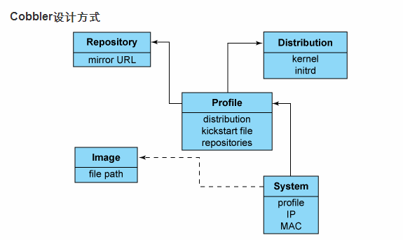

# cobbler 相关



## 一、关闭selinux

##### 1、修改配置
```
vim /etc/selinux/config

#SELINUX=enforcing
#SELINUXTYPE=targeted
SELINUX=disabled
```
##### 2、配置生效
```
setenforce 0
```
## 二、关闭防火墙
```
systemctl stop firewalld
systemctl disable firewalld
```
## 三、安装Cobbler
##### 1.安装最新的epel库
```
#rpm -Uvh https://dl.fedoraproject.org/pub/epel/7/x86_64/e/epel-release-7-8.noarch.rpm
rpm -ivh http://mirrors.aliyun.com/epel/epel-release-latest-7.noarch.rpm
```
##### 2.安装Cobbler以及相关的包
```
#yum install cobbler cobbler-web pykickstart xinetd dhcp dnsmasq syslinux -y

yum install cobbler cobbler-web pykickstart xinetd dhcp httpd tftp -y
```
##### 3.启动Cobbler及其他服务
```
systemctl enable cobblerd
systemctl start cobblerd
systemctl enable httpd
systemctl start httpd
systemctl enable xinetd
systemctl start xinetd
```
> Cobbler-Web提供了一个网站管理服务，默认用户名和密码都是"cobbler",Web浏览地址可以通过以下链接： https://172.18.50.30/cobbler_web  //注意是https

##四、配置Cobbler

##### 1、设置文件里的default_password_crypted控制在kickstart过程中的新系统的超级用户口令
```
openssl passwd -1

生成系统的root用户密码
$1$Ve0a/FjX$GmL.ZpJYdvFPoYdpT1Zqb1
```
##### 2、修改/etc/cobbler/settings配置
```
vim /etc/cobbler/settings

default_password_crypted: "$1$Ve0a/FjX$GmL.ZpJYdvFPoYdpT1Zqb1"
manage_dhcp: 1
manage_dns: 1
next_server: 172.168.50.30（主机名）
pxe_just_once: 1
server: 172.168.50.30（主机名）
```
##### 3、修改/etc/xinetd.d/tftp配置
```
vim /etc/xinetd.d/tftp
disable = no
```
##### 4、修改/etc/cobbler/dhcp.template配置
```
subnet 172.18.50.0 netmask 255.255.255.0 {
     option routers             172.18.50.254;  #网关
     option domain-name-servers 61.139.2.69;   #DNS
     option subnet-mask         255.255.255.0;  #子网掩码
     range dynamic-bootp        172.18.50.35 172.18.50.39;  #ip范围
     default-lease-time         21600;
     max-lease-time             43200;
     next-server                $next_server;
     class "pxeclients" {
          match if substring (option vendor-class-identifier, 0, 9) = "PXEClient";
          if option pxe-system-type = 00:02 {
                  filename "ia64/elilo.efi";
          } else if option pxe-system-type = 00:06 {
                  filename "grub/grub-x86.efi";
          } else if option pxe-system-type = 00:07 {
                  filename "grub/grub-x86_64.efi";
          } else {
                  filename "pxelinux.0";
          }
     }

}
```
##### 5、修改/etc/cobbler/dnsmasq.template配置一个简单的DHCP server
```
vim /etc/cobbler/dnsmasq.template

...
read-ethers
addn-hosts = /var/lib/cobbler/cobbler_hosts

dhcp-range=172.18.50.35,172.18.50.39
dhcp-option=3,$next_server
dhcp-lease-max=1000
dhcp-authoritative
dhcp-boot=pxelinux.0
dhcp-boot=net:normalarch,pxelinux.0
dhcp-boot=net:ia64,$elilo
```
$insert_cobbler_system_definitions

##### 6、检查及同步Cobbler
```
systemctl restart cobblerd
```
##### 7、其他问题
```
cobbler check (这个命令帮助检测Cobbler配置目前仍然存在的问题，根据提示修改这些问题，然后重启cobbler即可)

注：这里cobbler check 遇到的有:

    1 : SELinux is enabled. Please review the following wiki page for details on ensuring cobbler works correctly in your SELinux environment:
    https://github.com/cobbler/cobbler/wiki/Selinux
    2 : named is not installed and/or in path
    3 : some network boot-loaders are missing from /var/lib/cobbler/loaders, you may run 'cobbler get-loaders' to download them, or, if you only want to handle x86/x86_64 netbooting, you may ensure that you have installed a *recent* version of the syslinux package installed and can ignore this message entirely.  Files in this directory, should you want to support all architectures, should include pxelinux.0, menu.c32, elilo.efi, and yaboot. The 'cobbler get-loaders' command is the easiest way to resolve these requirements.
    4 : enable and start rsyncd.service with systemctl
    5 : debmirror package is not installed, it will be required to manage debian deployments and repositories
    6 : fencing tools were not found, and are required to use the (optional) power management features. install cman or fence-agents to use them
    
     解决：
    1、关闭selinux，前面已经改过，先忽略
    
    2、yum install bind -y
    
    3、cobbler get-loaders
    
    4、systemctl enable rsyncd
       systemctl start rsyncd
    
    5、rpm -Uvh ftp://rpmfind.net/linux/epel/6/x86_64/debmirror-2.14-2.el6.noarch.rpm  --nodeps --force
    
       修改debmirror配置/etc/debmirror.conf
    
       vim /etc/debmirror.conf
    
       #@dists="sid";  #注释
       #@arches="i386";  #注释
    
    6、yum install fence-agents -y

systemctl restart cobblerd
cobbler sync
```
## 五、导入Distribution
```
mkdir /mnt/iso
mount -o loop /dev/cdrom /mnt/iso   #也可以挂载iso文件
cobbler import --arch=x86_64 --path=/mnt/iso --name=CentOS-7
cobbler distro list
cobbler profile list
cobbler distro report --name=CentOS-7-x86_64   #显示详细信息
```
## 六、删除导入的系统
```
cobbler profile find --distro=CentOS-7-x86_64 #查看配置是否存在
cobbler profile remove --name=CentOS-7-x86_64 #删除配置文件
cobbler distro remove --name=CentOS-7-x86_64 #删除distro
cobbler profile find --distro=CentOS-7-x86_64 #再查看配置已无
```