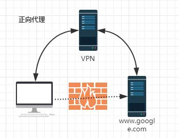
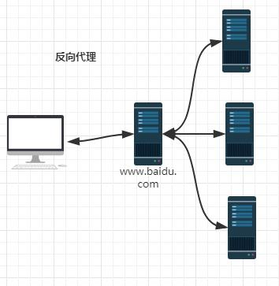

# nginx 相关

# 一、介绍

##### 正向代理



##### 反向代理



由于不能直接访问google，那么可以借助NPV来实现，这就是一个简单的正向代理的例子。可以发现，正向代理“代理”的是客户端，而且客户端是知道目标的，而目标是不知道客户端是通过NPV访问的。

当我们在外网访问百度的时候，其实会进行一个转发，代理到内网去，这就是所谓的反向代理，即反向代理“代理”的是服务器端，而且这一个过程对于客户端而言是透明的。

##### 1、启动ngnx

```
docker run -d -p 192.168.21.32:80:80 --name nginx nginx
```

##### 2、下面四种情况分别用http://192.168.1.4/proxy/test.html 进行访问。

- 第一种：

  ```
  location /proxy/ {
       proxy_pass http://127.0.0.1:81/;
  }
  会被代理到http://127.0.0.1:81/test.html 这个url
  ```

- 第二种(相对于第一种，最后少一个 /)

  ```
  location /proxy/ {
       proxy_pass http://127.0.0.1:81;
  }
  会被代理到http://127.0.0.1:81/proxy/test.html 这个url
  ```

- 第三种：

  ```
  location /proxy/ {
       proxy_pass http://127.0.0.1:81/ftlynx/;
  }
  会被代理到http://127.0.0.1:81/ftlynx/test.html 这个url。
  ```

- 第四种情况(相对于第三种，最后少一个 / )：

  ```
  location /proxy/ {
       proxy_pass http://127.0.0.1:81/ftlynx;
  }
  会被代理到http://127.0.0.1:81/ftlynxtest.html 这个url
  ```

##### 3、配置实例nginx

```
server {
    listen 80;
    server_name  192.168.21.33;
#access_log  logs/quancha.access.log  main;
#error_log  logs/quancha.error.log;
#root   html;
#index  index.html index.htm index.php;

## send request back to apache ##
location / {
    proxy_pass  http://192.168.21.100:80;

    #Proxy Settings
    proxy_redirect     off;
    proxy_set_header   Host             $host;
    proxy_set_header   X-Real-IP        $remote_addr;
    proxy_set_header   X-Forwarded-For  $proxy_add_x_forwarded_for;
    proxy_next_upstream error timeout invalid_header http_500 http_502 http_503 http_504;
    proxy_max_temp_file_size 0;
    proxy_connect_timeout      90;
    proxy_send_timeout         90;
    proxy_read_timeout         90;
    proxy_buffer_size          4k;
    proxy_buffers              4 32k;
    proxy_busy_buffers_size    64k;
    proxy_temp_file_write_size 64k;
       }
}
```

```
server
{
    listen 80;
    server_name xxx123.tk;
    location / {
        proxy_redirect off;
        proxy_set_header Host $host;
        proxy_set_header X-Real-IP $remote_addr;
        proxy_set_header X-Forwarded-For $proxy_add_x_forwarded_for;
        proxy_pass http://192.168.10.38:3000;
    }
    access_log logs/xxx123.tk_access.log;
}
```

```
server
{
    listen 80;
    server_name xxx456.tk;
    location / {
        proxy_redirect off;
        proxy_set_header Host $host;
        proxy_set_header X-Real-IP $remote_addr;
        proxy_set_header X-Forwarded-For $proxy_add_x_forwarded_for;
        proxy_pass http://192.168.10.40:80;
    }
    access_log logs/xxx456.tk_access.log;
}
```

# 二、使用

##### 1、常用配置

```
autoindex on;# 显示目录
autoindex_exact_size on;# 显示文件大小
autoindex_localtime on;# 显示文件时间
```

