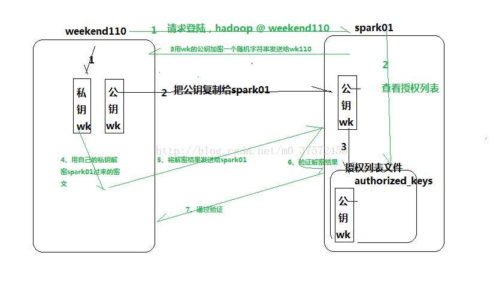

# ssh 相关

# 一、免密登录



```
ssh-keygen

ssh-copy-id root@IP

PreferredAuthentications publickey,password
#PreferredAuthentications password
StrictHostKeyChecking no
ServerAliveInterval 15
ServerAliveCountMax 3

Host bosh 
    hostname bosh
    user ubuntu

Host hl
    hostname hl
    user centos

Host ep
    hostname 192.168.0.57
    user root
    port 50010
```

# 二、使用pptpd

```
apt-get install pptpd
pptpsetup -create pptpd -server 222.209.209.209 -username node2 -password 123456  -encrypt -start
如果断开了在机器上执行pon pptpd
```

# 三、sshpass

```
yum install -y sshpass
# apt install -y sshpass

sshpass -p 123456 ssh -p 1000 root@192.168.11.11
sshpass -p 123456 scp -o StrictHostKeyChecking=no -r ../run.sh root@192.168.0.24:/tmp/
```

# 四、常见问题

1、Write failed: Broken pipe

> 问题现象
>
> 用 ssh 命令连接服务器之后，如果一段时间不操作，再次进入 Terminal 时会有一段时间没有响应，然后就出现错误提示：
>
> Write failed: Broken pipe
>
> 只能重新用 ssh 命令进行连接。

> 解决方法
>
> 方法一：如果您有多台服务器，不想在每台服务器上设置，只需在客户端的 ~/.ssh/ 文件夹中添加 config 文件，并添加下面的配置：
>
> ServerAliveInterval 60
>
> 方法二：如果您有多个人管理服务器，不想在每个客户端进行设置，只需在服务器的 /etc/ssh/sshd_config 中添加如下的配置：
>
> ClientAliveInterval 60
>
> 方法三：如果您只想让当前的 ssh 保持连接，可以使用以下的命令：
>
> $ ssh -o ServerAliveInterval=60 user@sshserver
>
> ssh连接超时问题解决方案：
> 1.修改server端的etc/ssh/sshd_config
> ClientAliveInterval 60 ＃server每隔60秒发送一次请求给client，然后client响应，从而保持连接
> ClientAliveCountMax 3 ＃server发出请求后，客户端没有响应得次数达到3，就自动断开连接，正常情况下，client不会不响应
>
> 2.修改client端的etc/ssh/ssh_config添加以下：（在没有权限改server配置的情形下）
> ServerAliveInterval 60 ＃client每隔60秒发送一次请求给server，然后server响应，从而保持连接
> ServerAliveCountMax 3  ＃client发出请求后，服务器端没有响应得次数达到3，就自动断开连接，正常情况下，server不会不响应

# 五、ssh 权限限制

cat /etc/security/access.conf

```
#允许所有用户配置atd和cron服务
+ : ALL : atd cron
#允许本地root用户通过ssh访问自己
+ : root : 127.0.0.1 localhost imgr7 hostname

+ : root : test01 test02
+ : root : 192.168.0.1 192.168.0.2 

# All other users should be denied to get access from all sources.
#-:ALL:ALL
- : root : ALL    
```

```
systemctl restart sshd
```

cat /etc/pam.d/sshd

```
#%PAM-1.0
auth       required     pam_sepermit.so
auth       include      password-auth
account    sufficient   pam_listfile.so item=user sense=allow onerr=fail file=/etc/ssh/allowed_users
account required pam_access.so
account    required     pam_nologin.so
account    include      password-auth
password   include      password-auth
auth       substack     password-auth
auth       include      postlogin
# Used with polkit to reauthorize users in remote sessions
-auth      optional     pam_reauthorize.so prepare
account    required     pam_nologin.so
account    include      password-auth
password   include      password-auth
# pam_selinux.so close should be the first session rule
session    required     pam_selinux.so close
session    required     pam_loginuid.so
# pam_selinux.so open should only be followed by sessions to be executed in the user context
session    required     pam_selinux.so open env_params
session    required     pam_namespace.so
session    optional     pam_keyinit.so force revoke
session    include      password-auth
session    include      postlogin
session    required     pam_mkhomedir.so
# Used with polkit to reauthorize users in remote sessions
-session   optional     pam_reauthorize.so prepare
#account required pam_access.so
```

```
systemctl restart sshd
```

