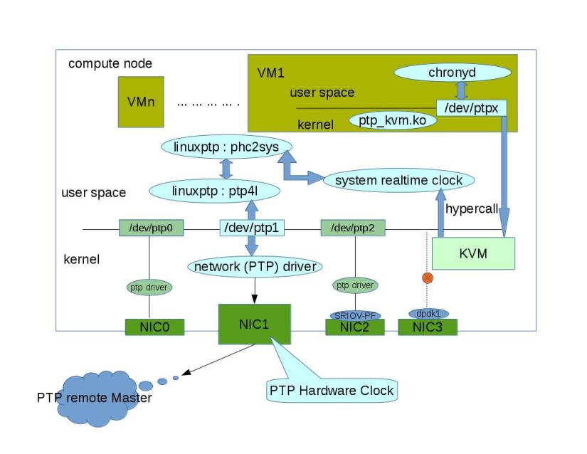

# ptp 相关

## 一、介绍

##### 1、什么是PTP？

> PTP(Precision Time Protocol)是一个通过网络同步时钟的一个协议。当硬件支持时，PTP精度能达到亚微秒，比NTP（Network Time Protocol）精度更高。
>
> 在云中使用PTP的两部分

1）在linux内核中使用kvm虚拟ptp驱动。

2）ptp使用TripleO（一个openstack的安装软件）配置。

##### 2、操作系统里的PTP

> 操作系统支持PTP被分开在kernel和user space，比如Redhat或者CentOS，内核支持PTP时钟，由网络驱动提供（硬件PTP依赖物理网卡提供硬件时钟），可以手动检查网卡是否支持PTP

```
ethtool -T eth0
```

> 实现协议是linuxptp，PTPv2的实现是根据linux的1588v2标准。
>
> linuxptp软件包包含 ptp4l 和 phc2sys 两个时钟同步程序。
>
> ptp4l程序实现了PTP时钟和普通时钟。通过硬件时间戳，它被用来同步物理网卡到远端主时钟的PTP硬件时钟。
>
> phc2sys程序需要硬件时间戳，在网卡上（NIC）同步系统时钟到PTP硬件的时钟。

##### 3、KVM virtual PTP driver

> 在云环境中，我们想要所有运行在云上的客户虚拟机都有和主机拥有相同精度的时钟，这就是为什么需要KVM virtual PTP driver。为了使用这一特性，需要更新主机和虚拟机的内核，然后在虚拟机中执行以下的步骤

1) 加载kvm ptp驱动

```
modprobe kvm_ptp

#lsmod | grep ptp
#modprobe -r raid1
```

2)将下面内容添加到chrony的配置文件中(/etc/chrony.conf)

```
refclock PHC /dev/ptp0 poll 3 dpoll -2 offset 0
```

3) 确认ptp设备是否在时间源列表里

```
chronyc sources
```



1）网络（PTP）驱动是一个公共的支持硬件PTP的linux网络驱动（如：ixgbe.ko），使用'ethtool -T eth0'来检查硬件网络是否支持PTP。

2）Linuxptp是针对Linux根据IEEE 1588v2标准实现的精准时钟协议（PTP）。

3）Linuxptp：ptp4l实现Boundary Clock (BC) 和Ordinary Clock (OC)，为了同步ptp硬件时钟（PHC）到远端主时钟。

4）Linuxptp：phc2sys在系统里同步两个或者更多的时钟，比如同步系统时钟到一个PTP硬件时钟（PHC）。

5）系统实时时钟是系统时钟（CLOCK_REALTIME）。

6）ptp_kvm.ko：内核模块，提供获取返回主机实时时钟的方法。允许chrony以高精度同步主机和客户端时钟。

7）通过kvm虚拟ptp驱动，所有的虚拟机在同一个计算节点可以实现相同的时钟精度，通过使用一个支持ptp的网卡作为时间源。

8）一个明显的注意事项是linuxptp利用网络（ptp）驱动程序将PHC同步到远程PTP主机，NIC3不能用于此目的，因为它使用的是dpdk（vfio + pmd驱动程序）而不是内核网络驱动程序。（虽然dpdk支持获取时间戳，但不确定它是否是ovs或linuxptp的有效请求，以利用dpdk驱动程序将PHC同步到远程PTP主机）。

##### 4、Openstack/TripleO 支持 PTP

> 在云中启用PTP的最后一步，是在openstack环境中部署和配置PTP，在本文中，我们使用TripleO来提供PTP的配置路径。  如果熟悉TripleO，我们首先需要一个规范来详细说明ptp功能。 在本规范中，我们将考虑基本的PTP使用场景 - 普通时钟（从机模式），但可以根据此初始工作轻松扩展以支持边界时钟或主时钟。

> ptp配置向操作员公开了三个参数:

1) PTP硬件接口名称

```
PtpInterface: 'nic1'
```

2) 配置PTP时钟为从模式

```
PtpSlaveMode: 1
```

3) 配置PTP消息传输协议

```
PtpMessageTransport: 'UDPv4'
```

> 第一个参数是'PtpInterface'，这是我们通常在物理接口上配置ptp服务最重要的一个参数，与软件时间戳相比，它给我们提供了更准确的时间。

> 第二个参数是'PtpSlaveMode'，它在从模式（普通时钟）中配置ptp服务。

> 第三个参数是'PtpMessageTransport'，它指定了ptp消息的传输协议，它支持三种类型的传输协议，例如'L2'，'UDPv4'和'UDPv6'。

##### 5、其他

> 如果有一个复杂的云环境，例如，使用SR-IOV，部署在云中的DPDK技术，我们可能需要关于如何配置和使用ptp的更多考虑因素。

1) NTP

> 由于大多数云默认安装NTP，启用ptp服务意味着我们必须考虑NTP和PTP的共存，无论是将PTP源提供给NTP还是反之亦然。 如果您不打算在其中一个已部署的节点上部署PTP的主控，则后者可能不会发生。 linuxptp还提供了一种利用NTP和PTP的方法，即使用timemaster，它是一个程序（可以配置为服务），它使用ptp4l和phc2sys结合chronyd或ntpd将系统时钟同步到NTP 和PTP时间源。 您可能还想考虑对在NTP上回复的服务或组件可能产生的影响。

2) DPDK

> 如上所述，PTP在内核网络驱动程序中使用PHC（PTP硬件时钟）框架来获取/设置硬件时间戳并调整硬件PHC时间。 启用了dpdk的网卡不使用内核网络驱动程序，后者又不能用作PTP时间源。 虽然dpdk库支持get / set方法等基本时间功能，但如果没有适当的用户空间程序或与这些dpdk方法交互的OVS，我们就无法使用它。 因此，用户是否应该在部署期间注意此缺陷，或者我们应该在支持dpdk的card＆ptp启用卡上建立隔离。

3) SR-IOV

> 使用支持sriov的卡，用户可以选择PF passthrough以从PTP获得准确的时间，或使用kvm虚拟ptp驱动程序将系统时间同步到主机实时时钟。 但是如果选择将启用ptp的PF传递给VM，那么如果PF是唯一配置的ptp接口，则计算节点中的主机和其他VM可能会丢失ptp时间源。 所以解决方法是用户知道sriov PF上的PTP配置，而不是将PF附加到任何VM，或者我们在部署期间建立隔离以避免可能中断唯一的PTP时间源。 使用sriov PF作为PTP源的另一个缺点是VF不能仅仅因为没有为VF分配这样的硬件资源而共享PF的PHC。

4) TC (Transparent Clock)

> 在实际网络中，在商品硬件交换机或路由器中配置透明时钟来测量数据包通过交换机或路由器所花费的停留时间，然后将停留时间添加到PTP数据包的校正字段中以供从机进一步使用 模式时钟，以减少数据包延迟变化的影响。 但是linuxptp不支持透明时钟Transparent Clock（TC），如果想要使用软件来实现TC，有一些问题需要考虑：TC必须像交换机一样运行，尽管你可以使用Linux来桥接多个端口，但仍然是性能 不如真正的开关。 因此，没有人会对基于Linux软件开关构建的TC感兴趣。

5）kvm ptp

> 优势：使用kvm虚拟ptp驱动程序，同一计算节点中的所有VM可以通过使用一个支持ptp的NIC作为时间源来实现相同的时间精度。

## 二、实例

> hypercall
>
> linuxptp: phc2sys、ptp4l

### （1）在主机中执行

##### 1、查看网卡是否支持ptp

```
ethtool -T eth0
```

##### 2、安装ptp4l和phc2sys

```
yum -y install linuxptp
```

##### 3、启动ptp4l

```
service ptp4l start
```

##### 4、选择eth0作为ptp时钟，网卡上的时钟同步到主设备时从ptp4l输出的示例

```
ptp4l -i eth0 -m -S
```

##### 5、phc2sys程序是用来同步网卡上的系统时钟和ptp硬件时钟（PHC）（可选）

```
vim /etc/sysconfig/phc2sys

OPTIONS="-a-r"

service phc2sys restart
```

* -a选项使phc2sys读取要从ptp4l应用程序同步的时钟。
* -s选项将系统时钟同步到特定接口的PTP硬件时钟。
* -w选项等待运行ptp4l应用程序的同步PTP时钟，然后检索TAI到UTC偏离ptp4l。
* -r系统时钟有资格成为时间源。

##### 6、当不想启动phc2sys作为一个系统服务，可以在命令行启动

```
phc2sys -a -r
```

> 使用-s选项将系统时钟与特定接口的PTP硬件时钟同步。
>
>  -w选项等待正在运行的ptp4l应用程序同步PTP时钟，然后从ptp4l检索TAI到UTC的偏移量。

```
phc2sys -s eth0 -w
```

> PTP以国际原子时（TAI）时间刻度运行，而系统时钟保持协调世界时（UTC）。 TAI和UTC时间尺度之间的当前偏移量为36秒。 插入或删除闰秒时，偏移量会发生变化，这通常每隔几年就会发生一次。 当不使用-w时，需要使用-O选项手动设置此偏移量，如下所示：

```
phc2sys -s eth0 -O -36
```

### （2）在虚拟机中执行

##### 1、deltaos6

```
gettime
```

##### 2、centos7

```
1、查看是否支持ptp
ethtool -T eth0

2、加载kvm ptp驱动
modprobe ptp_kvm

3、添加配置到chrony配置文件（/etc/chrony.conf）
refclock PHC /dev/ptp0 poll 3 dpoll -2 offset 0

4、确认ptp设备在时钟源列表中
chronyc sources -v

for f in `seq 1 100`; do chronyc sources | grep PHC0 ; sleep 1s; done
```

## 三、参考链接

https://zshisite.wordpress.com/2017/10/25/sync-your-cloud-with-ptp/
https://events.static.linuxfound.org/sites/events/files/slides/lcjp14_ichikawa_0.pdf
https://opensource.com/article/17/6/timekeeping-linux-vms
https://zshisite.wordpress.com/2017/10/25/sync-your-cloud-with-ptp/
https://access.redhat.com/documentation/en-us/red_hat_enterprise_linux/6/html/deployment_guide/s1-starting_ptp4l
https://access.redhat.com/documentation/en-us/red_hat_enterprise_linux/6/html/deployment_guide/s1-synchronizing_the_clocks