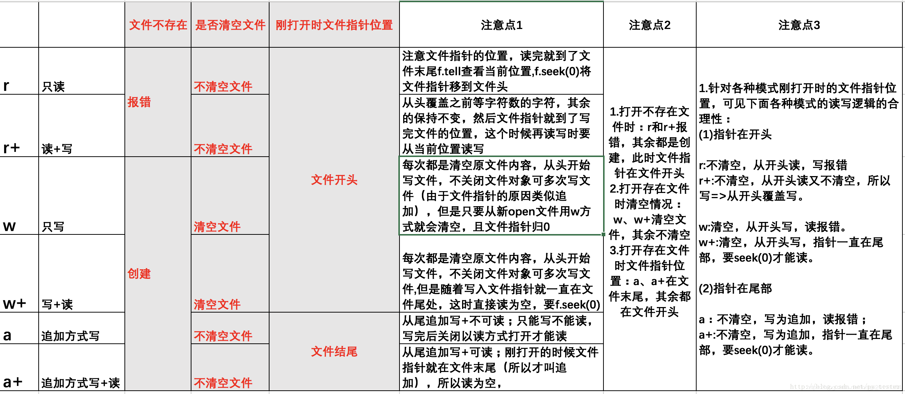

# Python 文件操作

> open(file, mode='r', buffering=-1, encoding=None, errors=None, newline=None, closefd=True, opener=None)

##### 1、参数说明

- file: 必需，文件路径（相对或者绝对路径）。
- mode: 可选，文件打开模式
- buffering: 设置缓冲
- encoding: 一般使用utf8
- errors: 报错级别
- newline: 区分换行符
- closefd: 传入的file参数类型
- opener:

##### 2、mode参数

| 模式 | 描述                                                         |
| :--- | :----------------------------------------------------------- |
| t    | 文本模式 (默认)。                                            |
| x    | 写模式，新建一个文件，如果该文件已存在则会报错。             |
| b    | 二进制模式。                                                 |
| +    | 打开一个文件进行更新(可读可写)。                             |
| U    | 通用换行模式（**Python 3 不支持**）。                        |
| r    | 以只读方式打开文件。文件的指针将会放在文件的开头。这是默认模式。 |
| rb   | 以二进制格式打开一个文件用于只读。文件指针将会放在文件的开头。这是默认模式。一般用于非文本文件如图片等。 |
| r+   | 打开一个文件用于读写。文件指针将会放在文件的开头。           |
| rb+  | 以二进制格式打开一个文件用于读写。文件指针将会放在文件的开头。一般用于非文本文件如图片等。 |
| w    | 打开一个文件只用于写入。如果该文件已存在则打开文件，并从开头开始编辑，即原有内容会被删除。如果该文件不存在，创建新文件。 |
| wb   | 以二进制格式打开一个文件只用于写入。如果该文件已存在则打开文件，并从开头开始编辑，即原有内容会被删除。如果该文件不存在，创建新文件。一般用于非文本文件如图片等。 |
| w+   | 打开一个文件用于读写。如果该文件已存在则打开文件，并从开头开始编辑，即原有内容会被删除。如果该文件不存在，创建新文件。 |
| wb+  | 以二进制格式打开一个文件用于读写。如果该文件已存在则打开文件，并从开头开始编辑，即原有内容会被删除。如果该文件不存在，创建新文件。一般用于非文本文件如图片等。 |
| a    | 打开一个文件用于追加。如果该文件已存在，文件指针将会放在文件的结尾。也就是说，新的内容将会被写入到已有内容之后。如果该文件不存在，创建新文件进行写入。 |
| ab   | 以二进制格式打开一个文件用于追加。如果该文件已存在，文件指针将会放在文件的结尾。也就是说，新的内容将会被写入到已有内容之后。如果该文件不存在，创建新文件进行写入。 |
| a+   | 打开一个文件用于读写。如果该文件已存在，文件指针将会放在文件的结尾。文件打开时会是追加模式。如果该文件不存在，创建新文件用于读写。 |
| ab+  | 以二进制格式打开一个文件用于追加。如果该文件已存在，文件指针将会放在文件的结尾。如果该文件不存在，创建新文件用于读写。 |

##### 3、常用方法

| 序号 | 方法                                                         | 描述                                                         |
| :--- | :----------------------------------------------------------- | ------------------------------------------------------------ |
| 1    | [file.close()](https://www.runoob.com/python3/python3-file-close.html) | 关闭文件。关闭后文件不能再进行读写操作。                     |
| 2    | [file.flush()](https://www.runoob.com/python3/python3-file-flush.html) | 刷新文件内部缓冲，直接把内部缓冲区的数据立刻写入文件, 而不是被动的等待输出缓冲区写入。 |
| 3    | [file.fileno()](https://www.runoob.com/python3/python3-file-fileno.html) | 返回一个整型的文件描述符(file descriptor FD 整型), 可以用在如os模块的read方法等一些底层操作上。 |
| 4    | [file.isatty()](https://www.runoob.com/python3/python3-file-isatty.html) | 如果文件连接到一个终端设备返回 True，否则返回 False。        |
| 5    | [file.next()](https://www.runoob.com/python3/python3-file-next.html) | Python 3 中的 File 对象不支持 next() 方法。返回文件下一行。  |
| 6    | [file.read([size\])](https://www.runoob.com/python3/python3-file-read.html) | 从文件读取指定的字节数，如果未给定或为负则读取所有。         |
| 7    | [file.readline([size\])](https://www.runoob.com/python3/python3-file-readline.html) | 读取整行，包括 "\n" 字符。                                   |
| 8    | [file.readlines([sizeint\])](https://www.runoob.com/python3/python3-file-readlines.html) | 读取所有行并返回列表，若给定sizeint>0，返回总和大约为sizeint字节的行, 实际读取值可能比 sizeint 较大, 因为需要填充缓冲区。 |
| 9    | [file.seek(offset[, whence\])](https://www.runoob.com/python3/python3-file-seek.html) | 移动文件读取指针到指定位置                                   |
| 10   | [file.tell()](https://www.runoob.com/python3/python3-file-tell.html) | 返回文件当前位置。                                           |
| 11   | [file.truncate([size\])](https://www.runoob.com/python3/python3-file-truncate.html) | 从文件的首行首字符开始截断，截断文件为 size 个字符，无 size 表示从当前位置截断；截断之后后面的所有字符被删除，其中 Widnows 系统下的换行代表2个字符大小。 |
| 12   | [file.write(str)](https://www.runoob.com/python3/python3-file-write.html) | 将字符串写入文件，返回的是写入的字符长度。                   |
| 13   | [file.writelines(sequence)](https://www.runoob.com/python3/python3-file-writelines.html) | 向文件写入一个序列字符串列表，如果需要换行则要自己加入每行的换行符。 |

```
f.seek(-3, 2)  # 移动到文件倒数第三个字节
f.seek(5)      # 移动到文件的第六个字节
```

```
with open(r'./README.md', "a+") as f:
    print(f.readlines())
```
##### 4、其他

| 模式 | 可做操作 | 若文件不存在 | 是否覆盖   |
| ---- | -------- | ------------ | ---------- |
| r    | 只能读   | 报错         | -          |
| r+   | 可读可写 | 报错         | 是         |
| w    | 只能写   | 创建         | 是         |
| w+   | 可读可写 | 创建         | 是         |
| a    | 只能写   | 创建         | 否，追加写 |
| a+   | 可读可写 | 创建         | 否，追加写 |

